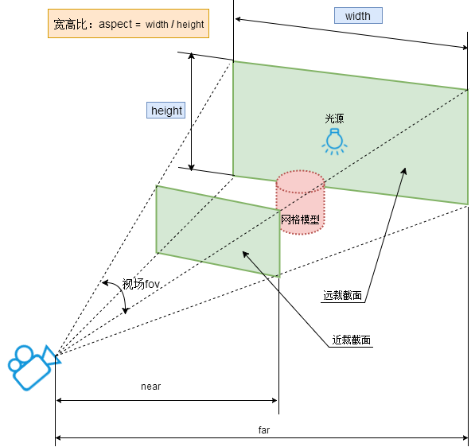
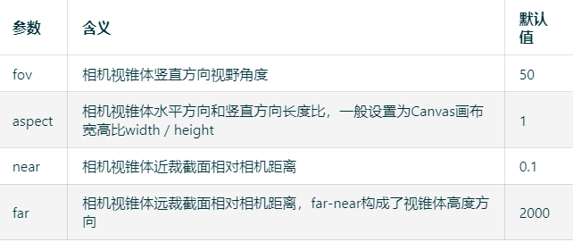

- 只有常见的模型、方法，更全的请看<a href="https://threejs.org/" target="_blank"><b>Three.js官网</b></a>或<a href="https://github.com/mrdoob/three.js/tree/master" target="_blank"><b>源码</b></a>
- 基于**类**实现，创建好之后添加到场景`scene`中，再渲染出来
- 每节的参数是和对应功能相关的，不一定全，但所有的加起来基本覆盖常用的

## 1. 相机示意



## 2.  第一个模型
```tsx
import { defineComponent, ref, onMounted } from "vue";
import * as THREE from 'three';

export default defineComponent({
    name: 'FirstPractice',
    setup() {
        // 场景
        const scene = new THREE.Scene();
        scene.background = new THREE.Color('#DEFEFF'); // 场景的颜色
        // 透视相机，参数是视场角fov、视野宽高比、近截面距离、远截面距离
        const camera = new THREE.PerspectiveCamera(75, 1.0, 0.1, 1000);
        // 相机位置，x、y、z
        camera.position.set(0, 0, 300);
        // 相机看哪，注意这两个的顺序
        camera.lookAt(20, 5, 0);
        // 如果后面container的宽高变了，设置camera.aspect，然后更新相机的投影矩阵
        // camera.updateProjectionMatrix();

        // 长方体，参数长、宽、高
        const geometry = new THREE.BoxGeometry(100, 100, 100);
        // 基础网格材质，不受光照影响
        const material = new THREE.MeshBasicMaterial({
            color: 0x00ff00,
            transparent: true, // 开启透明
            opacity: 0.7, // 设置不透明度
        });
        // 网格模型
        let mesh = new THREE.Mesh(geometry, material);
        // 模型位置
        mesh.position.set(0, 0, 10);
        // 加入场景，移除用remove()
        scene.add(mesh);

        // 渲染器
        const renderer = new THREE.WebGLRenderer({
            antialias: true, // 抗锯齿
            alpha: true // 背景透明
        });
        // 设置宽高
        renderer.setSize(500, 500);
        // 渲染
        renderer.render(scene, camera);
        // 之后获取及设置相机位置、相机看哪、几何体的长宽高、mesh的位置等，需要重新渲染
        // 如geometry.parameters获取长宽高对象

        // 每帧动画
        let scaleXRate = 0.1;
        let positionZ = 2;
        function animate() {
            requestAnimationFrame(animate);
            // 在0.1倍——3倍缩放x
            if (mesh.scale.x > 3) {
                scaleXRate = -0.1;
            } else if (mesh.scale.x < 0.1) {
                scaleXRate = 0.1;
            }
            mesh.scale.x += scaleXRate;

            mesh.rotation.y += 0.01; // 绕y轴旋转

            // z轴距屏幕远近
            if (mesh.position.z > 200) {
                positionZ = -4;
            } else if (mesh.position.z < -200) {
                positionZ = 4;
            }
            mesh.position.z += positionZ;
            renderer.render(scene, camera);
        };
        animate();

        const container = ref<HTMLDivElement>();
        // 挂载后添加到dom中
        onMounted(() => { container.value!.appendChild(renderer.domElement) });

        return () => (
            <div ref={container}></div>
        )
    }
});
```
## 3. 类的定义
**`Object3D`的父类是`EventDispatcher`，有所有子类的<span style="color:red;font-size:25px">事件</span>，后面都省略，只写到`Object3D`**
<table>
<tr>
<td></td>
<td>

```tsx
class Scene extends Object3D {
    constructor() {
        super();
        // ...
    }
}
```
</td>
<td rowspan="2">

```tsx
class Object3D extends EventDispatcher {
    constructor() {
        super();
        // ...
    }
}
```
</td>
</tr>

<tr>
<td>

```tsx
class PerspectiveCamera extends Camera {
    constructor( fov = 50, aspect = 1, near = 0.1, far = 1000 ) {
        super();
        // ...
    }
}
```
</td>
<td>

```tsx
class Camera extends Object3D{
    constructor() {
        super();
        // ...
    }
}
```
</td>
</tr>
</table>
