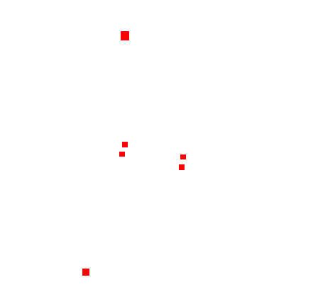

## 1. 类的定义
<table>
<tr>
<td>

```tsx
class Points extends Object3D {
    constructor( geometry = new BufferGeometry(), material = new PointsMaterial() ) {
        super();
        // ...
    }
}
```
</td>
<td>

```tsx
class Object3D extends EventDispatcher {
    constructor() {
        super();
        // ...
    }
}
```
</td>
</tr>

<tr>
<td>

```tsx
class PointsMaterial extends Material {
    constructor( parameters ) {
        super();
        // 属性：isPointMaterial、type、map、alphaMap、size、sizeAttenuation、fog
    }
}
```
</td>
<td>

```tsx
class Material extends EventDispatcher {
    constructor() {
        super();
        // ...
    }
}
```
</td>
</tr>
</table>

## 2. 例子
```tsx
const geometry = new THREE.BufferGeometry();
const vertices = new Float32Array([
    0, 0, 0,
    50, 0, 0,
    0, 100, 0,
    0, 0, 10,
    0, 0, 100,
    50, 0, 10
]);
const attribute = new THREE.BufferAttribute(vertices, 3);
geometry.setAttribute('position', attribute);

const material = new THREE.PointsMaterial({color:'red', size: 6});
const mesh = new THREE.Points(geometry, material);
mesh.position.set(0, 0, 0);
scene.add(mesh);
```

