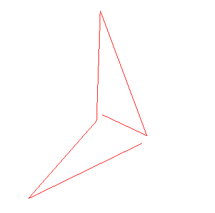
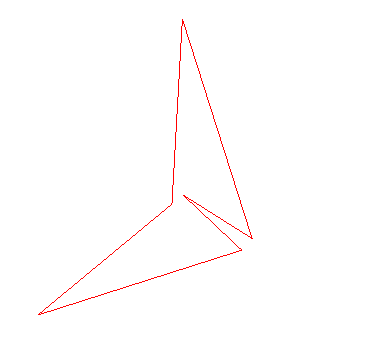
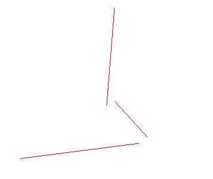

:zap: `Mesh`网格模型(面)、`Point`点、`Line`线，三者平级
:heavy_check_mark: `geometry`通用，只不过不同的模型把它看做不同的类型，加入不同的材质进行渲染
- `LineLoop`环线，`LineSegments`线段
## 1. 类的定义
<table>
<tr>
<td>

```tsx
class LineLoop extends Line {
    constructor( geometry, material ) {
        super( geometry, material );
        // ...
    }
}
```
</td>
<td rowspan="2">

```tsx
class Line extends Object3D {
    constructor( geometry = new BufferGeometry(), material = new LinBasicMaterial() ) {
        super();
        // ...
    }
}
```
</td>
</tr>

<tr>
<td>

```tsx
class LineSegments extends Line {
    constructor( geometry, material ) {
        super( geometry, material );
        // ...
        // 方法 computeLineDistance()
    }
}
```
</td>
</tr>
</table>

<table>
<tr>
<td>

```tsx
class LineDashedMaterial extends LineBasicMaterial {
    constructor( parameters ) {
        super();
        // 本身需要初始化的参数有scale = 1、dashSize = 3、gapSize = 1
    }
}
```
</td>
<td>

```tsx
class LineBasicMaterial extends Material {
    constructor( parameters ) {
        super();
        // map、lineWidth、linecap、linejoin、fog
    }
}
```
</td>
<td>

```tsx
class Material extends EventDispatcher {
    constructor() {
        super();
        // ...
    }
}
```
</td>
</tr>
</table>

## 2. 例子
<table>
<tr>
<td  style="width:600px;max-width:600px;">

```tsx
const material = new THREE.LineBasicMaterial({color:'red'});
const mesh = new THREE.Line(geometry, material);
```
</td>
<td style="min-width:160px"></td>
</tr>
<tr>
<td>

```tsx
const material = new THREE.LineBasicMaterial({color:'red'});
const mesh = new THREE.LineLoop(geometry, material);
```
</td>
<td></td>
</tr>

<tr>
<td>

```tsx
const material = new THREE.LineBasicMaterial({color:'red'});
const mesh = new THREE.LineSegments(geometry, material);
```
</td>
<td></td>
</tr>
</table>
