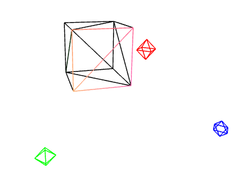
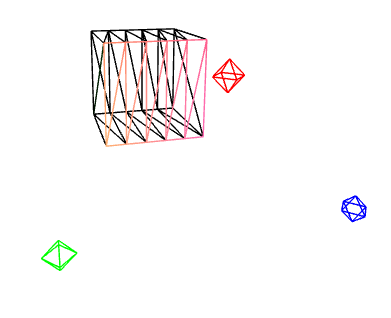
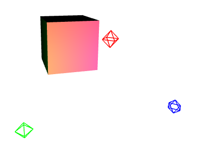

## 1. 汇总
<table>
<tr align="center">
<td>子类</td>
<td>子类中的属性、方法</td>
<td>父类</td>
<td>父类中的共有属性方法</td>
</tr>

<tr align="center">
<td>

`Mesh`
</td>
<td>

`isMesh`、`type`、`geometry`、`material` 
`copy(source,recursive)`、`updateMorphTargets()`、`getVertexPosition(index,target)`、`raycast(raycaster,intersects)`
</td>
<td rowspan="3">

`Object3D`
</td>
<td rowspan="3">

`isObject3D`、`uuid`、`type`、`parent`、`children`、`up`、`position` 
`rotation`、`quaternion`、`scale`、`matrix`、`matrixWorld`、`matrixAutoUpdate` 
`matrixWorldAutoUpdate`、`matrixWorldNeedsUpdate`、`layers`、`visible`等 
`onBeforeRender()`、`onAfterRender()`、`rotateOnAxis(axis, angle)` 
`rotateOnWorldAxis(axis, angle)`、`rotateX(angle)`、`rotateY(angle)`、`rotateZ(angle)` 
`translateOnAxis(axis,distance)`、`translateX(distance)`、`translateY(distance)`、`translateZ(distance)` 
`lookAt(x,y,z)`、`add(object)`、`remove(object)`、`removeFromParent()`、`clear()` 
`getObjectById(id)`、`getObjectByName(name)`、`getObjectByProperty(name,value)`、`getObjectsByProperty(name,value,result=[])` 
`getWorldPosition(target)`、`getWorldScale(target)`、`getWorldDirection(target)`、`traverse(callback)` 
`updateMatrix()`、`updateMatrixWorld(force)`、`updateWorldMatrix(updateParents,updateChildren)` 
`toJSON(meta)`、`clone(recursive)`、`copy(source,recursive=true)`
</td>
</tr>

<tr align="center">
<td>

`Points`
</td>
<td>

`isPoints`、`type`、`geometry`、`material` 
`copy(source,recursive)`、`raycast(raycaster,intersects)`、`updateMorphTargets()`
</td>
</tr>

<tr align="center">
<td>

`Line`、`LineLoop`、`LineSegments`
</td>
<td>

`isLine`、`type`、`geometry`、`material` 
`copy(source,recursive)`、`computeLineDistances()`、`raycast(raycaster,intersects)`、`updateMorphTargets()`
</td>
</tr>
</table>

<table>
<tr align="center">
<td>子类</td>
<td>子类中的属性、方法</td>
<td>父类</td>
<td>父类中的共有属性方法</td>
</tr>

<tr align="center">
<td>

`MeshBasicMaterial`
</td>
<td>

`isMeshBasicMaterial`、`type`、`color`、`map`、`wireframe`、`envMap`、`envMapRotation`、`fog`等 
`copy(source)`
</td>
<td rowspan="7">

`Material`
</td>
<td rowspan="7">

`isMaterial`、`uuid`、`name`、`type`、`blending`、`side`、`vertexColors`、`opacity`、`transparent`、`alphaHash`、`visible`等 
`toJSON(meta)`、`clone()`、`copy(source)`、`dispose()`
</td>
</tr>

<tr align="center">
<td>

`MeshLambertMaterial`
</td>
<td>

`isMeshLambertMaterial`、`type`、`color`、`map`、`wireframe`、`envMap`、`envMapRotation`、`fog`等 
`copy(source)`
</td>
</tr>

<tr align="center">
<td>

`MeshPhongMaterial`
</td>
<td>

`isMeshPhongMaterial`、`type`、`shininess`、`specular`、`map`、`wireframe`、`envMap`、`envMapRotation`、`fog`等 
`copy(source)`
</td>
</tr>

<tr align="center">
<td>

`MeshStandardMaterial`
</td>
<td>

`isMeshStandardMaterial`、`defines`、`type`、`color`、`roughness`、`metalness`、`map`、`wireframe`、`envMap`、`envMapRotation`、`envMapIntensity`、`fog`等 
`copy(source)`
</td>
</tr>
<tr align="center">
<td>

`PointsMaterial`
</td>
<td>

`isPointsMaterial`、`type`、`color`、`size`、`sizeAttenuation`、`alphaMap`、`fog`等 
`copy(source)`
</td>
</tr>

<tr align="center">
<td>

`LineBasicMaterial`
</td>
<td>

`isLineBasicMaterial`、`type`、`color`、`map`、`linewidth`、`linecap`、`linejoin`、`fog`等 
`copy(source)`
</td>
</tr>
</table>

<table>
<tr align="center">
<td>

`MeshPhysicalMaterial`
</td>
<td>

`isMeshPhysicalMaterial`、`defines`、`type`等 
`copy(source)`、一些`get`和`set`
</td>
<td>

`MeshStandardMaterial`
</td>
<td>见↑</td>
</tr>

<tr>
<td>

`LineDashedMaterial`
</td>
<td>

`isLineDashedMaterial`、`type`、`scale`、`dashSize` 
`copy(source)`
</td>
<td>

`LineBasicMaterial`
</td>
<td>见↑</td>
</tr>
</table>

:white_check_mark: 这些属性可以在构造**材质**是传入，也可以后面再改；
- 这里只有常用的，遇到有问题的多查官网

## 2. 材质的`wireframe`效果
<table>
<tr align="center">
<td  style="width:300px;">

`wireframe`
</td>
<td style="width:300px">

`widthSegments` 这里只试了宽
</td>
<td  style="width:300px;">效果</td>
</tr>

<tr align="center">
<td rowspan="2">

`true`
</td>
<td>1 ( 默认 )</td>
<td></td>
</tr>

<tr align="center">
<td>5</td>
<td></td>
</tr>

<tr align="center">
<td>

`false`
</td>
<td>几都不显示</td>
<td></td>
</tr>
</table>

## 3. 旋转、平移、缩放相关
:ballot_box_with_check: `Mesh`、`Line`、`LineLoop`、`LineSegment`、`Points`来自共同的父类——`Object3D`，它来自`EventDispatcher`；
:ballot_box_with_check: `Light`也继承`Object3D`；
:white_check_mark: 要查看、修改位置、旋转、缩放等，以这里为准

:one: 位置、平移相关
| 操作  |                                      属性、方法                                      |
| :---: | :----------------------------------------------------------------------------------: |
| 查看  |               `.position`、`.position.x`、`.position.y`、`.position.z`               |
| 修改  | 设置位置：`.position.set(1,1,1)`、`.position.x = 1`等、 平移`.translateZ(100)`等 |

:two: 角度、旋转相关
| 操作  |                            属性、方法                             |
| :---: | :---------------------------------------------------------------: |
| 查看  |     `.rotation`、`.rotation.x`、`.rotation.y`、`.rotation.z`      |
| 修改  | `.rotation.set(1,1,1)`、`.rotation.x = 1`等、 `.rotateZ(1)`等 |

:three: 比例、缩放相关
| 操作  |                  属性、方法                  |
| :---: | :------------------------------------------: |
| 查看  | `.scale`、`.scale.x`、`.scale.y`、`.scale.z` |
| 修改  | `.scale.set(1,1,1)`、`.scale.x = 1`等、  |

