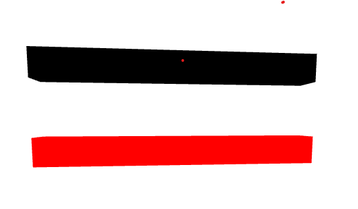
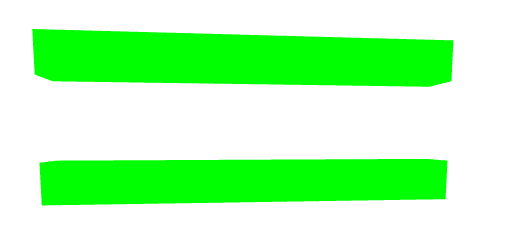
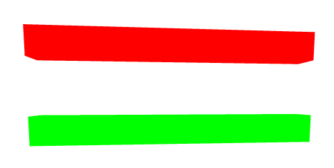
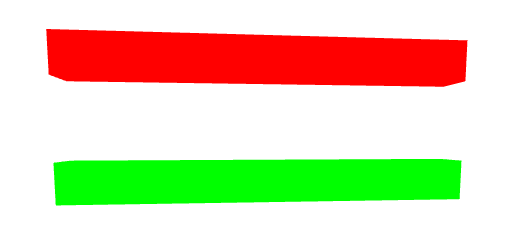

:ballot_box_with_check: `Mesh`、`Points`、`Line`、`LineLoop`、`LineSegments`、`Camera`、`Light`都是`Object3D`的子类
## 1. 位置相关
- 三维向量
:ballot_box_with_check: 也继承自`Object3D`，拥有其提供的所有属性方法；
:white_check_mark:没有`position`属性；
:white_check_mark:其他三维物体的`position`是`Vector3`的实例；
:white_check_mark:其他三维物体要绕轴平移、旋转，绕的都是**三维向量实例**

|           常用方法            |                      说明                       |
| :---------------------------: | :---------------------------------------------: |
|           `add(v)`            |                加另一个三维向量                 |
|        `addScalar(s)`         |                x、y、z都加数字s                 |
|         `normalize()`         |           归一化，自身会变，返回结果            |
|         `set(x,y,z)`          |                      设置                       |
| `setX(x)`、`setY(y)、setZ(z)` |                    分别设置                     |
|          `toArray()`          |                    转未数组                     |
|     `clone()`、`copy(v)`      |                 克隆自身、复制v                 |
|         `multiply(v)`         | 本身的x、y、z和三维向量v的x、y、z分别相乘，返回 |
|          `divide(v)`          |             x、y、z别相除，返回结果             |
|           `dot(v)`            |   它的x、y、z和三维向量v的x、y、z相乘再加起来   |
|              ...              |                       ...                       |


## 2. 角度相关
- 欧拉对象（Euler）和四元数对象（Quaternion）
:white_check_mark:其他三维物体的`rotation`是`Euler`的实例；
```tsx
// 可以.x、.y、.z分别设置
const a = new THREE.Euler( 0, 1, 1.57, 'XYZ' );
const b = new THREE.Vector3( 1, 0, 1 );
b.applyEuler(a);
```
:white_check_mark:其他三维物体的`quaternion`是`Quaternion`的实例；
- 用法看官网


## 3. 颜色相关
- 材质的`.color`属性是`Color`的实例；
- 改的时候可以通过`material.color.set(r,g,b)`或单独设置r、g、b；
```tsx
const color = new THREE.Color();
// 不传默认0xffffff
```
|                              常用方法                               |      说明       |
| :-----------------------------------------------------------------: | :-------------: |
|   `set(r,g,b)`、`set(0xffffff)`、`rgb(1,2,3)`、`rgba(0,0,0,0.1)`    |      修改       |
|                         `setScalar(scalar)`                         | rgb都改成scalar |
|               `setHex(hex,colorSpace=SRGBColorSpace)`               |                 |
| `setRGB( r, g, b, colorSpace = ColorManagement.workingColorSpace )` |                 |
| `setHSL( h, s, l, colorSpace = ColorManagement.workingColorSpace )` |                 |
|                      `clone()`、`copy(color)`                       |                 |
|                                 ...                                 |       ...       |

## 4. 补充

:ballot_box_with_check: 通过`Mesh`等对象的`geometry`、`material`可以访问他用到的几何体和材质，也可以修改；
:ballot_box_with_check: 多个对象共享`geometry`或`material`，修改一个的，都会变；可以根据比如`name`判断是否共享同一`material`或`geometry`等；
:ballot_box_with_check: `geometry`没有`position`，但有`translate(x,y,z)`用于平移；
<br/>
:ballot_box_with_check: 如果不想共享，可以用`clone`或`copy`复制；
:white_check_mark: `Object3D`的`v.clone()`，返回和原对象(v)一样的对象；
:white_check_mark: `Object3D`的`v2.copy(v1)`，把v1复制给v2；
:white_check_mark: **克隆和复制切断了和原来的联系，再改原来的不影响克隆和复制的结果**；
```tsx
// mesh2是一个用BufferGeometry和MeshPhongMaterial创建的mesh
const t1 = mesh2.clone();
const t2 = new THREE.Mesh(new THREE.BoxGeometry(), new THREE.MeshPhongMaterial());
t2.copy(mesh2);
console.log(t1.geometry===t2.geometry, t1.material===t2.material);
// true true
```

<table>
<tr align="center">
<td  style="width:600px;max-width:600px;">操作</td>
<td style="min-width:160px">效果</td>
</tr>

<tr align="center">
<td  style="width:600px;max-width:600px;">原来</td>
<td></td>
</tr>

<tr align="center">
<td>

```tsx
// 直接赋值，改了mesh的material之后mesh2的material会跟着变
mesh2.material = mesh.material;
mesh.material.color.set(0x00ff00);
```
</td>
<td></td>
</tr>

<tr align="center">
<td>

```tsx
// 使用.copy()，不会跟着变
mesh2.material.copy(mesh.material);
mesh.material.color.set(0x00ff00);
```
</td>
<td></td>
</tr>

<tr align="center">
<td>

```tsx
mesh2.material = mesh.material.clone();
mesh.material.color.set(0x00ff00);
```
</td>
<td></td>
</tr>
</table>

