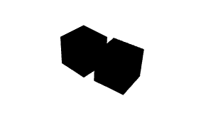
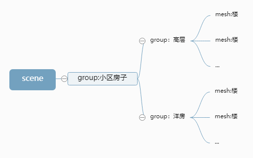
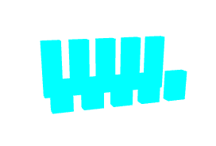
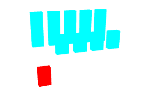
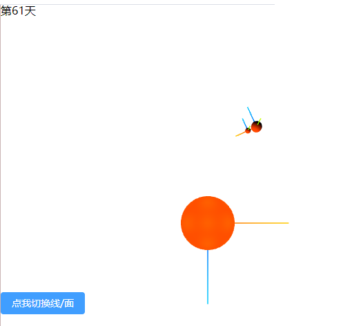
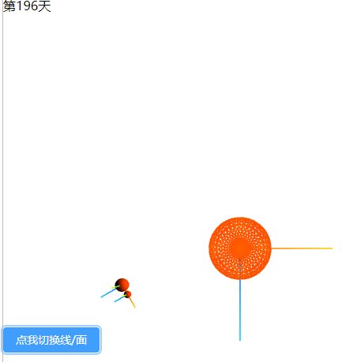
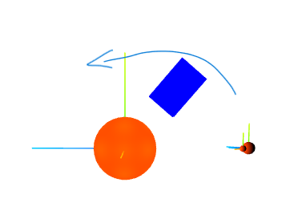
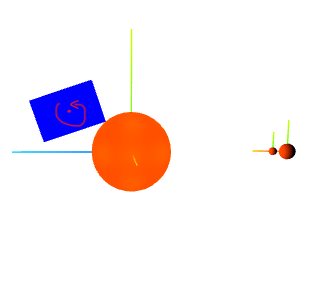
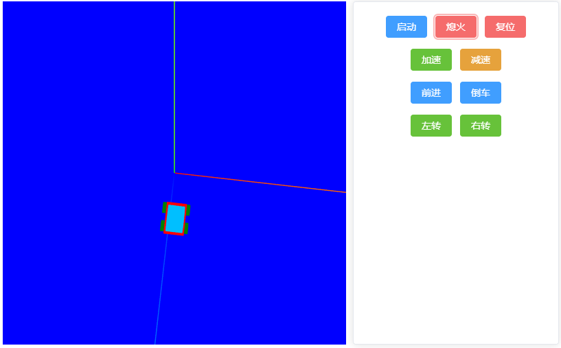

:ballot_box_with_check: `Group`类，继承自`Object3D`
:white_check_mark: 常用来作为其它物体(`Mesh`等)的**容器**；
:white_check_mark: 有时候也用`new THREE.Object3D()`，同`new THREE.Group()`，但后者更语义化；
:white_check_mark: `Scene`、`Mesh`、`Line`、`LineLoop`、`LineSegments`、`Points`、`Light`、`Camera`等继承了`Object3D`的类创建的实例都有以下的属性和方法；

<table>
<tr align="center">
<td>属性、方法
</td>
<td>说明
</td>
</tr>

<tr align="center">
<td>

`position`、`position.x`、`position.y`、`position.z`、`position.set(x,y,z)`、`position.x = 1`、`translateX(1)`、`position.y = 1`、`translateY(1)`、`position.z = 1`、`translateZ(1)`、`translateOnAxis(axis, distance)`

</td>
<td>位置、位移
</td>
</tr>

<tr align="center">
<td>

`rotation`、`rotation.x`、`rotation.y`、`rotation.z`、`rotation.set(x,y,z)`、`rotation.x = 1`、`rotateX(1)`、`rotation.y = 1`、`rotateY(1)`、`rotation.z = 1`、`rotateZ(1)`、`rotateOnAxis(axis, angle)`、`rotateOnWorldAxis(axis, angle)`

</td>
<td>角度、旋转
</td>
</tr>

<tr align="center">
<td>

`scale`、`scale.x`、`scale.y`、`scale.z`、`scale.set(x,y,z)`、`scale.x = 1`、`scale.y = 1`、`scale.z = 1`

</td>
<td>比例、缩放
</td>
</tr>

<tr align="center">
<td>

`add(c1[,c2,...])`、`remove(c1[,c2,...])`、`clear()`、`removeFromParent()`

</td>
<td>添加子对象、移除子对象、清空子对象、从富容器中移除它本身
</td>
</tr>

<tr align="center">
<td>

`parent`、`children`

</td>
<td>父容器（只能有一个）、子对象（数组）
</td>
</tr>

<tr align="center">
<td>

`traverse(( obj ) => { })`

</td>
<td>

传入回调函数，遍历`children`，也可以手动遍历
</td>

</tr>

<tr align="center">
<td>

`name`、`getObjectBuName`

</td>
<td>命名、根据名字找子对象（找到之后获取属性或修改）</td>

</tr>

<tr align="center">
<td>

`visible`

</td>
<td>

`boolean`，模型显示或隐藏，材质也有这个属性
</td>

</tr>
</table>

:white_check_mark: 除此之外，他们自身有以下属性
|属性|描述|
|:--:|:--:|
|`isMesh`、`isPoints`等|是否是某类型|
|`type`|类型，比如`Line`|

:white_check_mark: 若对 group 进行平移、旋转、缩放，则 group 下的所有`children`也会跟着变；各自有各自的参数和运动，同时也受父容器参数和运动的影响；

## 1. 层级模型叠加例子

<table>
<tr>
<td  style="width:600px;max-width:600px;">

```tsx
// ...
const geometry = new THREE.BoxGeometry(20, 20, 20);
const material = new THREE.MeshLambertMaterial({ color: 0x00ffff });
const group = new THREE.Group();
const mesh1 = new THREE.Mesh(geometry, material);
const mesh2 = new THREE.Mesh(geometry, material);
mesh2.translateX(25);
group.add(mesh1);
group.add(mesh2);
scene.add(group);
// ...
const animate = () => {
    requestAnimationFrame(animate);
    // mesh1绕Y轴旋转和父容器绕Y轴旋转抵消
    // 只有mesh2在转
    mesh1.rotateY(0.01);
    group.rotation.y -= 0.01;
    renderer.render(scene, camera);
};
animate();
```

</td>
<td style="min-width:260px"></td>
</tr>
</table>

:white_check_mark: `Object3D`创建或继承它的类的实例都有属性`name`，用于起名：


## 2. 层级模型遍历例子

```tsx
const findObject = (target, name) => {
    if (target.name === name) {
        return target;
    }
    for (let item of target.children) {
        if (findObject(item, name)) {
            return item;
        }
    }
    return null;
};
// 自行遍历
const clickEvent = () => {
    let t = findObject(model, '6号楼');
    t && t.material.color.set('rgb(255,0,0)') && t.geometry.translate(0, -50, 0);
};
// 提供的方法
let t = model.getObjectByName('6号楼');
t && t.material.color.set('rgb(255,0,0)') && t.geometry.translate(0, -50, 0);
```

| 操作前后 |           效果           |
| :------: | :----------------------: |
|    前    |  |
|    后    |  |

## 3. 本地坐标和世界坐标

<table>
<tr align="center">
<td>

:tangerine:本地坐标
</td>

<td>自身在父容器中的坐标</td>
</tr>

<tr align="center">
<td>

:lemon: 世界坐标
</td>

<td>所有层父容器的位置和本地坐标叠加起来</td>
</tr>
</table>

:white_check_mark: `mesh.getWorldPosition()`获取某对象的世界坐标；
:white_check_mark: `const meshAxesHelper = new THREE.AxesHelper(50); mesh.add(meshAxesHelper)`给某对象添加一个局部坐标轴显示；

## 4. 例子

```tsx
setup() {
    const container = ref<HTMLDivElement>();
    const scene = new THREE.Scene();
    const camera = new THREE.PerspectiveCamera(75, 1.0, 0.1, 8000);
    camera.position.set(0, 2000, 0);
    camera.lookAt(0, 0, 0);
    const renderer = new THREE.WebGLRenderer({ alpha: true, antialias: true });
    renderer.setSize(600, 600);
    // renderer.setPixelRatio(Math.max(window.devicePixelRatio, 2));

    const geometry = new THREE.SphereGeometry(10);
    const material = new THREE.MeshPhongMaterial();
    // 太阳
    const sun = new THREE.Mesh(geometry, material);
    sun.scale.set(20, 20, 20);
    sun.position.set(0, 0, 0);
    sun.name = 'sun';

    // 坐标轴
    const axesHelper = new THREE.AxesHelper(600);
    scene.add(axesHelper);

    // 太阳光源
    for (let i of [-240, 0, 240]) {
        for (let j of [-240, 0, 240]) {
            for (let k of [-240, 0, 240]) {
                const sunPointLight = new THREE.PointLight(0xff4000, 100000);
                if (i === 0 && j == 0) {
                    sunPointLight.position.set(i, j, 1.4 * k);
                }
                else if (j === 0 && k === 0) {
                    sunPointLight.position.set(1.4 * i, j, k);
                } else if (i === 0 && k === 0) {
                    sunPointLight.position.set(i, 1.4 * j, k);
                } else {
                    sunPointLight.position.set(i, j, k);
                }
                scene.add(sunPointLight);
                // 光源可视化
                // const sunPointLightHelper = new THREE.PointLightHelper(sunPointLight, 40);
                // scene.add(sunPointLightHelper);
            }
        }
    }

    // 太阳系
    const sunGroup = new THREE.Group();
    sunGroup.name = 'sunGroup';
    sunGroup.add(sun);
    // 地球系统
    const earthGroup = new THREE.Group();
    earthGroup.position.set(800, 0, 0);
    const earthAxesHelper = new THREE.AxesHelper(160);
    earthGroup.add(earthAxesHelper);
    // 地球
    const earth = new THREE.Mesh(geometry, material);
    earth.scale.set(4, 4, 4);
    earthGroup.add(earth);
    // 月球
    const moonGroup = new THREE.Group();
    moonGroup.position.set(70, 0, 0);
    const moonAxesHelper = new THREE.AxesHelper(100);
    moonGroup.add(moonAxesHelper);
    const moon = new THREE.Mesh(geometry, material);
    moon.scale.set(2, 2, 2);
    moonGroup.add(moon);

    earthGroup.add(moonGroup);
    sunGroup.add(earthGroup);
    scene.add(sunGroup);

    renderer.render(scene, camera);

    // 轨道控制器
    const orbitControls = new OrbitControls(camera, renderer.domElement);
    orbitControls.target.set(0, 0, 0);

    let dayNum = ref<number>(0);
    let num = 0;
    function animate() {
        requestAnimationFrame(animate);
        if (num++ % 2 == 0) {
            // 地球公转
            // 如果不想让太阳也转，给太阳加一个相反的旋转
            sunGroup.rotation.y += Math.PI * 2 / 365;
            // 地球自转
            earth.rotation.y += Math.PI * 2;
            // 月球绕地球转
            // 只让月球转
            earthGroup.rotation.y += Math.PI * 2 / 28;
            earth.rotation.y -= Math.PI * 2 / 28;
            if (dayNum.value >= 365) {
                dayNum.value = 0;
            } else {
                dayNum.value += 1;
            }
        }

        renderer.render(scene, camera);
    }
    animate();
    onMounted(() => {
        container.value!.appendChild(renderer.domElement);
        // 双击全屏
        container.value!.ondblclick = () => {
            const t = document.fullscreenElement;
            t && document.exitFullscreen();
            !t && renderer.domElement.requestFullscreen();
        }
    });

    const show = ()=>{
        material.wireframe = !material.wireframe;
    }

    return () => (
        <>
            <div>第{dayNum.value}天</div>
            <div ref={container} class="container"></div>
            <el-button onClick={()=>show()} type="primary">点我切换线/面</el-button>
        </>
    )
}
```

-   效果

|  |  |
| :--------------------: | :----------------------: |

:ballot_box_with_check: 改变某物体的旋转，改变的是把他自己看成容器之后他自己的轴的旋转；要想绕其他轴旋转，加到其他容器中并旋转其它容器；
:white_check_mark: 不设置位置默认在父容器的`( 0, 0, 0 )`，设置位置是相对于父容器中心的；
:white_check_mark: 实现太阳系和方块不影响；

:ballot_box_with_check: 改变视角，`camera.position.set(x, y, z)`；

<table>
<tr align="center">
<td>实现</td>
<td style="min-width:160px">效果</td>
<td>描述</td>
</tr>

<tr align="center">
<td>

```tsx
const testGroup = new THREE.Group();
scene.add(testGroup);
const g1 = new THREE.BoxGeometry(100, 200, 300);
const m = new THREE.Mesh(g1, new THREE.MeshBasicMaterial({ color: 'blue' }));
m.position.set(0, 0, 500);
testGroup.add(m);

// animate()中
testGroup.rotation.x += 0.01;
```

</td>
<td></td>
<td>太阳系绕Y轴转，方块绕X轴转</td>
</tr>

<tr align="center">
<td>

```tsx
const g1 = new THREE.BoxGeometry(100, 200, 300);
const m = new THREE.Mesh(g1, new THREE.MeshBasicMaterial({ color: 'blue' }));
m.position.set(100, 200, 300);
scene.add(m);

// animate()中
m.rotation.x += 0.01;
```

</td>
<td></td>
<td>太阳系绕Y轴转，方块绕自己中心的X轴转</td>
</tr>
</table>

## 5. 控制小车运动例子

```tsx
setup() {
    const page = ref<HTMLDivElement>();
    const container = ref<HTMLDivElement>();
    const scene = new THREE.Scene();
    const globalCamera = new THREE.PerspectiveCamera(75, 1.0, 0.1, 7000);
    globalCamera.position.set(3000, 0, 0);
    globalCamera.lookAt(0, 0, 0);
    const renderer = new THREE.WebGLRenderer({
        antialias: true,
        alpha: true
    });
    renderer.setSize(500, 500, 500)
    renderer.setClearColor('rgb(0,0,255)');
    renderer.render(scene, globalCamera);


    // 车
    const carGroup = new THREE.Group();
    scene.add(carGroup);
    // 车轮
    const carWheelGroup = new THREE.Group();
    carGroup.add(carWheelGroup);
    const wheelRadius = 60;
    const wheelWidth = 50;
    function createWheel(x: number, z: number, name: string) {
        const sphereGeometry = new THREE.CylinderGeometry(wheelRadius, wheelRadius, wheelWidth);
        const wheelMaterial = new THREE.MeshBasicMaterial({ color: 'green' });
        const wheelMesh = new THREE.Mesh(sphereGeometry, wheelMaterial);
        wheelMesh.rotation.z = Math.PI / 2;
        wheelMesh.position.x = x;
        wheelMesh.position.z = z;
        wheelMesh.name = name;
        carWheelGroup.add(wheelMesh);
    }

    // 车体
    const bodyLength = 400;
    const bodyWidth = 260;
    const bodyHeight = 80;
    const boxGeometry = new THREE.BoxGeometry(bodyLength, bodyWidth, bodyHeight);
    const boxMaterial = new THREE.MeshBasicMaterial({ color: 'red' });
    const carBodyMesh = new THREE.Mesh(boxGeometry, boxMaterial);
    carBodyMesh.rotation.x = Math.PI / 2;
    carBodyMesh.rotation.z = Math.PI / 2;
    carBodyMesh.position.y = wheelRadius;
    carGroup.add(carBodyMesh);

    // 创建车轮
    const wheelInfoList = [
        [-1 * bodyWidth / 2 - wheelWidth / 2, - 1 * bodyLength * 0.3, '左前轮'],
        [bodyWidth / 2 + wheelWidth / 2, 1 * bodyLength * 0.3, '右前轮'],
        [-1 * bodyWidth / 2 - wheelWidth / 2, 1 * bodyLength * 0.3, '左后轮'],
        [bodyWidth / 2 + wheelWidth / 2, -1 * bodyLength * 0.3, '右后轮轮'],
    ];
    wheelInfoList.forEach(item => {
        createWheel(...item);
    });

    // 车顶
    const topGeometry = new THREE.CylinderGeometry(bodyLength / 3, bodyLength / 3, bodyWidth / 1.2, 32, 1, false, 0, Math.PI);
    const carTopMaterial = new THREE.MeshBasicMaterial({ color: 'deepskyblue' });
    const carTopMesh = new THREE.Mesh(topGeometry, carTopMaterial);
    carTopMesh.rotation.z = Math.PI / 2;
    carTopMesh.position.y = bodyHeight / 2 + wheelRadius - 60;
    carTopMesh.scale.z = 1.4;
    carGroup.add(carTopMesh);


    new OrbitControls(globalCamera, renderer.domElement);
    scene.add(new THREE.AxesHelper(10000));
    // 每帧
    let scaleZ = ref(1.2);
    let rotationX = ref(0);
    let speed = ref(0.0);
    let forwardOrBackward = ref(1); // 前进还是后退
    let state = ref(0); // 启动还是熄火
    let direction = ref('n'); // 转向
    const directions = ['n', 'e', 's', 'w'];
    function animate() {
        window.requestAnimationFrame(animate);
        carWheelGroup.children.forEach(item => {
            item.scale.z = scaleZ.value;
            item.rotation.x += rotationX.value;
        });
        direction.value === 'n' && (carGroup.position.z -= forwardOrBackward.value * speed.value);
        direction.value === 'e' && (carGroup.position.x += forwardOrBackward.value * speed.value);
        direction.value === 's' && (carGroup.position.z += forwardOrBackward.value * speed.value);
        direction.value === 'w' && (carGroup.position.x -= forwardOrBackward.value * speed.value);
        renderer.render(scene, globalCamera);
    }
    animate();


    onMounted(() => {
        container.value!.appendChild(renderer.domElement);
        container.value!.ondblclick = () => {
            if (!document.fullscreenElement) {
                page.value!.requestFullscreen();
            } else {
                document.exitFullscreen();
            }
        }
    });

    const startCar = () => {
        if (state.value) { return }
        forward();
        scaleZ.value = 1.2;
        rotationX.value = forwardOrBackward.value * 0.05;
        speed.value = 1;
        state.value = 1;
    };
    const stopCar = () => {
        if (!state.value) { return }
        scaleZ.value = 1.2;
        rotationX.value = 0;
        speed.value = 0;
        state.value = 0;
    };
    const resetPosition = () => {
        carGroup.position.x = 0;
        carGroup.position.y = 0;
        carGroup.position.z = 0;
    };
    const speedUp = () => {
        if (!state.value) { return }
        speed.value += 1;
    };
    const speedDown = () => {
        if (!state.value) { return }
        speed.value > 0 && (speed.value -= 1);
        speed.value == 0 && stopCar();
    };
    const forward = () => {
        forwardOrBackward.value = 1;
    };
    const backward = () => {
        forwardOrBackward.value = -1;
    };
    const turnLeft = () => {
        let index = directions.findIndex((item, index) => item == direction.value);
        let beforeIndex = index === 0 ? 3 : index - 1;
        direction.value = directions[beforeIndex];
        // 转车
        carGroup.rotation.y -= Math.PI / 2;
    };
    const turnRight = () => {
        let index = directions.findIndex((item, index) => item == direction.value);
        let afterIndex = index === 3 ? 0 : index + 1;
        direction.value = directions[afterIndex];
        carGroup.rotation.y += Math.PI / 2;
    };

    return () => (
        <div style="display:flex;padding:10px" ref={page}>
            <div ref={container}></div>
            <el-card style="width:300px;margin-left:10px;text-align:center">
                <el-button type="primary" onClick={() => { startCar() }}>启动</el-button>
                <el-button type="danger" onClick={() => { stopCar() }}>熄火</el-button>
                <el-button type="danger" onClick={() => { resetPosition() }}>复位</el-button>
                <br /><br />
                <el-button type="success" onClick={() => { speedUp() }}>加速</el-button>
                <el-button type="warning" onClick={() => { speedDown() }}>减速</el-button>
                <br /><br />
                <el-button type="primary" onClick={() => { forward() }}>前进</el-button>
                <el-button type="primary" onClick={() => { backward() }}>倒车</el-button>
                <br /><br />
                <el-button type="success" onClick={() => { turnLeft() }}>左转</el-button>
                <el-button type="success" onClick={() => { turnRight() }}>右转</el-button>
            </el-card>
        </div>
    )
}
```

效果：

