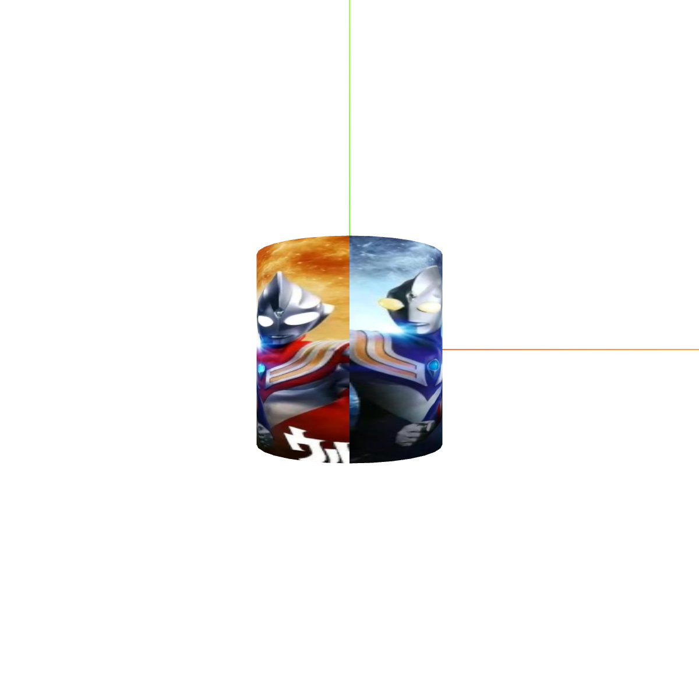

## 1. 说明
:ballot_box_with_check:  `canvas`标签保存为图片
:zap: 防止捕捉不到内容，<span style="color:red;font-size:20px;font-weight:bolder">获取之前要渲染一次</span>；
```tsx
const canvas = document.querySelector('canvas');

// 方法一
renderer.render(scene, camera);
const dataURL = canvas.toDataURL(); // 保存为base64
{
    const a = document.createElement('a');
    a.href = dataURL;
    a.download = 'download.png';
    a.click();
    a.remove();
    URL.revokeObjectURL(blob);
}
// 方法二
renderer.render(scene, camera);
canvas.toBlob(blob => {
    const a = document.createElement('a');
    a.href = createObjectURL(blob);
    a.download = 'download.png';
    a.click();
    a.remove();
    URL.revokeObjectURL(blob);
```

:ballot_box_with_check: `canvas`图片复制到剪贴板
```tsx
const clipToClipBoard = () => {
    renderer.render(scene, camera);
    renderer.domElement.toBlob((blob: any) => {
        const data = [new ClipboardItem({ [blob.type]: blob })];
        navigator.clipboard.write(data).then(() => {
            ElMessage({ type: 'success', message: '复制成功' });
        }).catch(() => {
            ElMessage({ type: 'error', message: '复制失败' });
        });
    });
};
// 通过 toDataURL()想要转回来，则要请求这个url拿到blob
```

:white_check_mark: 材质的`map`属性表示纹理贴图，可以初始化时传入，后面也可以`.map=   `修改；
:white_check_mark: **可与材质颜色叠加**；
:white_check_mark: 多个纹理，单独创建材质，分别添加到物体；
:white_check_mark: 用`PlaceGeometry`的话，可以设置材质的`side: THREE.DoubleSide`，不然只能看到一面；
:white_check_mark: `texture.colorSpace  = THREE.SRGBColorSpace;`//设置为SRGB颜色空间，不然有色差
:zap: 让纹理图片的文件大小和纹理尺寸都小（内存计算方式：$width * height * 4 * 1.3$），足够小但仍可以满足分辨率要求为准；

## 2. 添加一个/多个纹理
:ballot_box_with_check: 都继承`Loader`；`CubeTexture`继承`Texture`；
:white_check_mark: `TextureLoader`每次加载一个纹理，加载函数`load( url, onLoad, onProgress, onError ){}`；
:white_check_mark: `CubeTextureLoader`，每次可以加载6个纹理(urls写成数组)，加载函数`load( urls, onLoad, onProgress, onError ){}`，，**必须有相同宽高**；
:white_check_mark: 把每个纹理添加到每个材质，多个材质添加到物体，可以不同宽高；
:ballot_box_with_check: 可以用`setPath()`指定路径，再在`url`写具体图片名就行；
:ballot_box_with_check: 还有`loadAsync`方法；
```tsx
// .setPath(xxx)返回的是this，能链式调用
const textureCube = new THREE.CubeTextureLoader()
    .setPath('./环境贴图/环境贴图0/')
    .load(['px.jpg', 'nx.jpg', 'py.jpg', 'ny.jpg', 'pz.jpg', 'nz.jpg']);
```

<table>
<tr align="center">
<td  style="width:600px;max-width:600px;">

```tsx
// 加载一个图片纹理
// ...
const textureLoader = new THREE.TextureLoader();
// 或者第二个参数写(texture)=>{...}，加载之后再处理的一些操作
const texture = textureLoader.load('/api/static/markdown/front-end/three/image/texture/w=557&h=50.jpg');
texture.colorSpace  = THREE.SRGBColorSpace;//设置为SRGB颜色空间，不然有色差

const geometry = new THREE.BoxGeometry(400, 400, 400);
// 分别用了几种物体测试
// 这里没改colorSpace，但因为有蓝色背景，和原来区别不大
const material = new THREE.MeshBasicMaterial({ color: 'deepskyblue', map: texture });
const mesh = new THREE.Mesh(geometry, material);
mesh.position.set(0, 0, 0);
scene.add(mesh);
// ...
```
</td>
<td style="min-width:260px"></td>
</tr>

<tr align="center">
<td  style="width:600px;max-width:600px;">

```tsx
// 多个，这里使用loadManager
const loadingManger = new THREE.LoadingManager();
const textureLoader = new THREE.TextureLoader(loadingManger);
const imageURLList = [
    '/api/static/markdown/front-end/three/image/texture/w=557&h=50.jpg',
    '/api/static/markdown/front-end/three/image/texture/7060fda.jp.jpg',
    '/api/static/markdown/front-end/three/image/texture/猫-1.jpg',
    '/api/static/markdown/front-end/three/image/texture/猫-20.jpg',
    '/api/static/markdown/front-end/three/image/texture/卫星-15.jpg',
    '/api/static/markdown/front-end/three/image/texture/卫星-26.jpg'
];
const materialList = imageURLList.map(item => {
    const texture = textureLoader.load(item);
    texture.colorSpace = THREE.SRGBColorSpace;//设置为SRGB颜色空间
    const material = new THREE.MeshBasicMaterial({ map: texture });
    return material
});
// 或者
// let materialList: any[] = [];
// imageURLList.forEach(item => {
//     new Promise(resolve => {
//         const texture = textureLoader.load(item);
//         texture.colorSpace = THREE.SRGBColorSpace;//设置为SRGB颜色空间
//         const material = new THREE.MeshBasicMaterial({ map: texture });
//         return resolve(material)
//     }).then(material => {
//         materialList.push(material)
//     })
// });
loadingManger.onLoad = () => {
    const geometry = new THREE.BoxGeometry(200, 200, 200);
    const mesh = new THREE.Mesh(geometry, materialList);
    mesh.position.set(0, 0, 0);
    scene.add(mesh);
};
// 进度指示器
let loadingTextureProgress = ref<number>(0);
loadingManager.onProgress = (url0fLastItemLoaded, itemsLoaded, itemsTotal) => {
    loadingTextureProgress.value = itemsLoaded / itemsTotal;
};
```
</td>
<td></td>
</tr>
</table>

## 3. 设置几何体的`uv`
- 即要把纹理的哪部分范围放到材质上
<table>
<tr align="center">
<td  style="width:600px;max-width:600px;">

```tsx
// 设置 uv
const geometry = new THREE.BoxGeometry(100, 100, 100);
// 修改UV坐标
const uvs = new Float32Array([
    0, 0,
    0.5, 0,
    0.5, 0.5,
    0, 0.5,
]);
geometry.attributes.uv = new THREE.BufferAttribute(uvs, 2);
// ...
```
</td>
<td style="min-width:260px"></td>
</tr>
</table>

## 4. 照片墙
<table>
<tr align="center">
<td  style="width:600px;max-width:600px;">

```tsx
// 照片墙
const geometry = new THREE.PlaneGeometry(100, 100);
const textureLoader = new THREE.TextureLoader();
// 创建一块砖并添加
// 共用注意修改一个都会变的情况
const createOneBrick = (textureURL: string, x: number, y: number) => {
    textureLoader.load(textureURL, (texture: any) => {
        texture.colorSpace = THREE.SRGBColorSpace;
        const material = new THREE.MeshBasicMaterial({ map: texture, side: THREE.DoubleSide });
        const mesh = new THREE.Mesh(geometry, material);
        mesh.position.x = x;
        mesh.position.y = y;
        scene.add(mesh);
    });
};
const textureURLList = [
    '/api/static/markdown/front-end/three/image/texture/w=557&h=50.jpg',
    '/api/static/markdown/front-end/three/image/texture/7060fda.jp.jpg',
    '/api/static/markdown/front-end/three/image/texture/猫-2.jpg',
    '/api/static/markdown/front-end/three/image/texture/猫-174.jpg'
];
textureURLList.forEach((textureURL: string, index: number) => {
    const y = -100 * textureURLList.length / 2 + index * 100 + 50;
    for (let x = 0; x < textureURLList.length; x++) {
        createOneBrick(textureURL, -100 * textureURLList.length / 2 + x * 100 + 50, y);
    }
});
```
</td>
<td style="min-width:260px"></td>
</tr>
</table>

## 5. 透明纹理图片
:white_check_mark: 搭配透明背景的`png`，再设置`transparent: true`，透明部分不显示，常用于三维场景**标注**；

<table>
<tr>
<td  style="width:600px;max-width:600px;">

```tsx
const geometry = new THREE.BoxGeometry(100, 100,100); // and PlaneGeometry、SphereGeometry
const material = new THREE.MeshBasicMaterial({ transparent: true,side:THREE.DoubleSide });
const textureLoader = new THREE.TextureLoader();
const texture = textureLoader.load('/api/static/markdown/front-end/three/image/texture/transparent.png');
material.map = texture;
const mesh = new THREE.Mesh(geometry, material);
mesh.position.set(100,100,0);
scene.add(mesh);
```
</td>
<td style="min-width:260px"></td>
</tr>
</table>

## 6. 纹理重复和偏移
<table>
<tr>
<td  style="width:600px;max-width:600px;">

```tsx
// 重复
// ...
texture.repeat.x=4;
texture.wrapS = THREE.RepeatWrapping;
texture.repeat.y=3;
texture.wrapT = THREE.RepeatWrapping;
// 或者texture.repeat.set(xRepeat, yRepeat);
material.map = texture;
// ...
```
</td>
<td style="min-width:260px"></td>
</tr>

<tr>
<td>

```tsx
// 偏移
// ...
texture.offset.x = -0.5;
texture.offset.y = 0.5;
// ...
```
</td>
<td style="min-width:260px"></td>

</tr>
</table>


## 7. 视频纹理

```tsx
class VideoTexture extends Texture {
    // 传一个video的DOM就可以了
    constructor( video, mapping, wrapS, wrapT, magFilter, minFilter, format, type, anisotropy ) {
        super( video, mapping, wrapS, wrapT, magFilter, minFilter, format, type, anisotropy );
    }
}
```