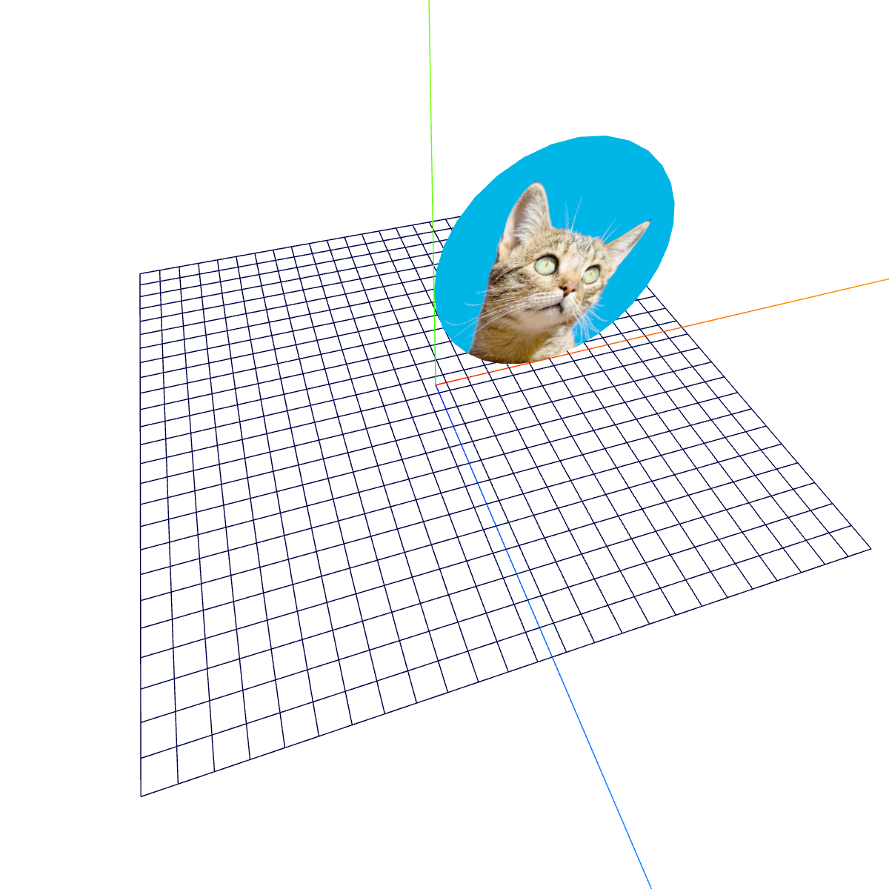
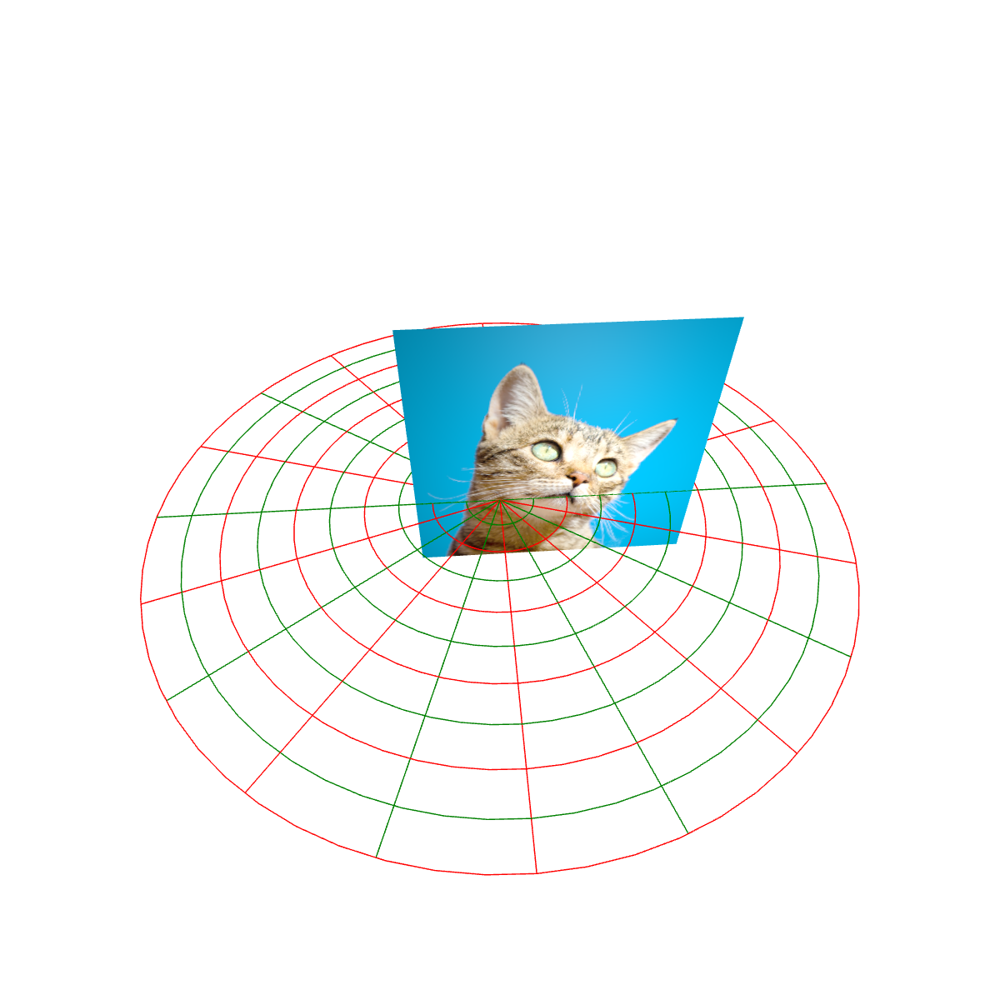
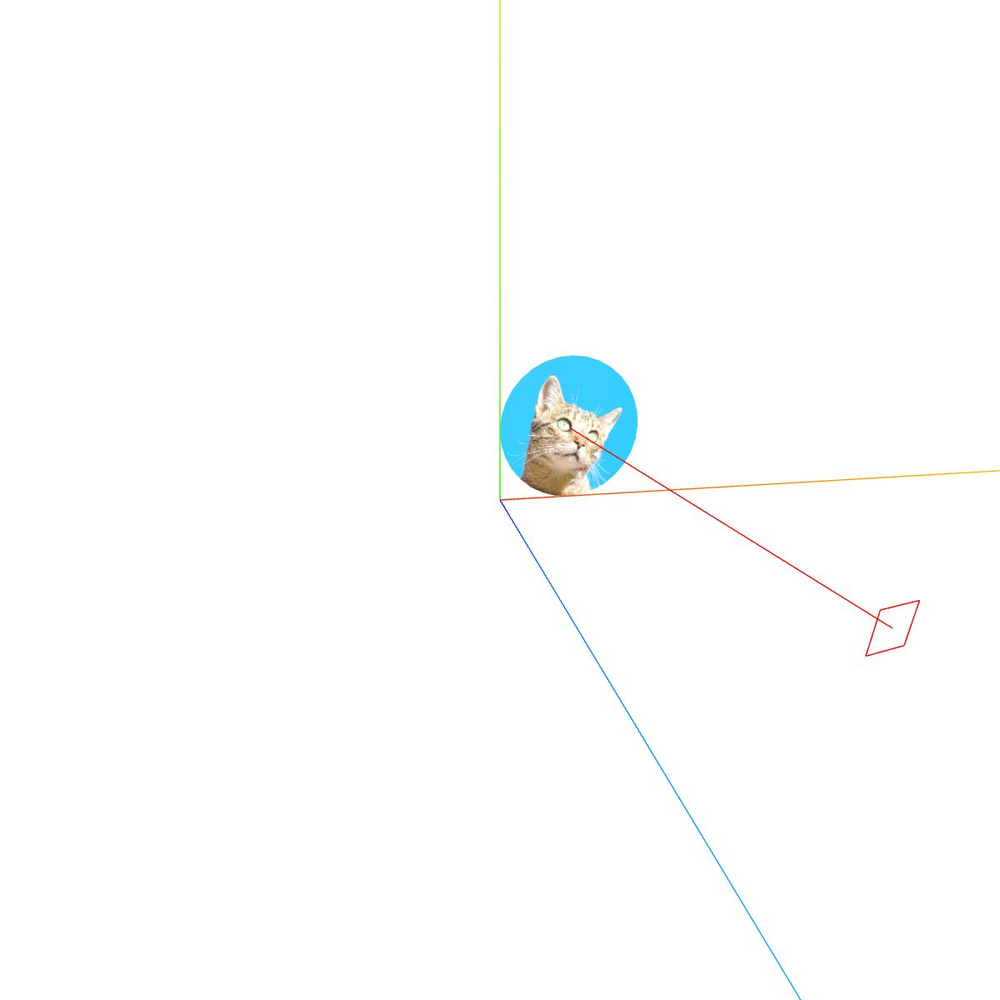
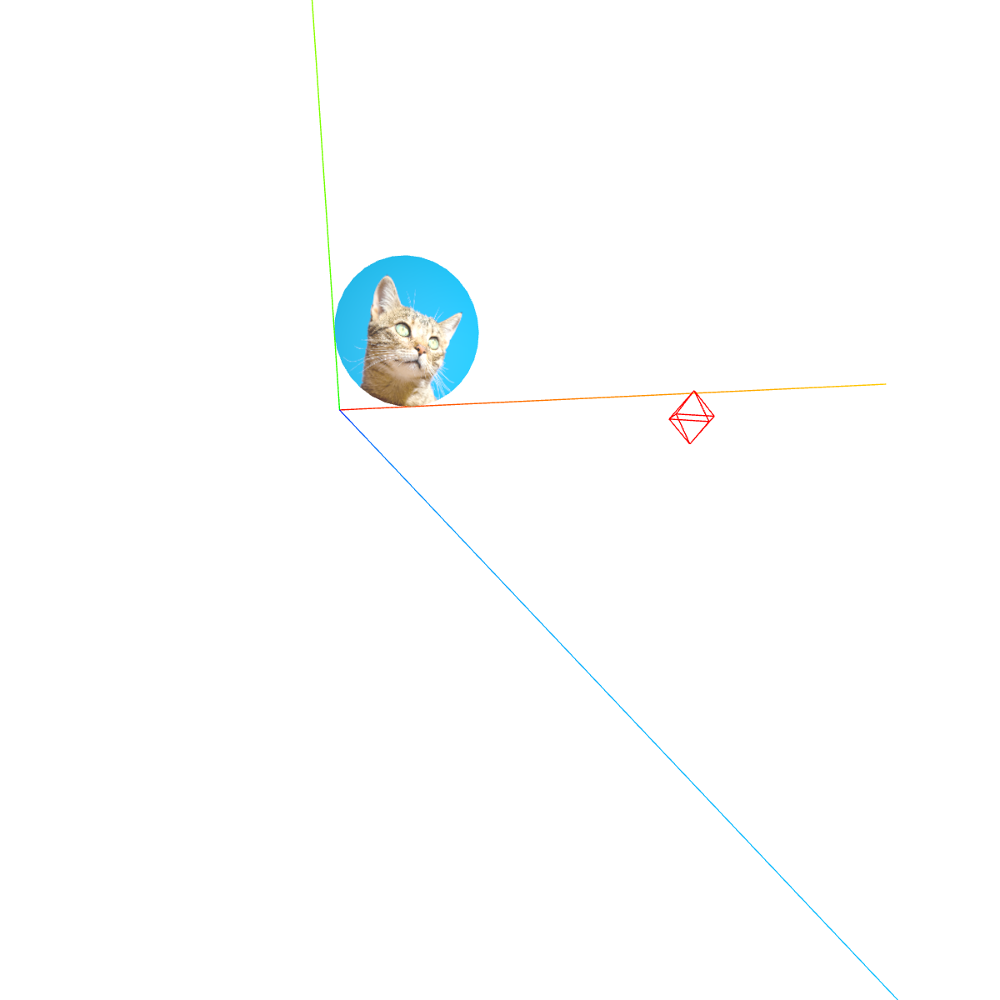
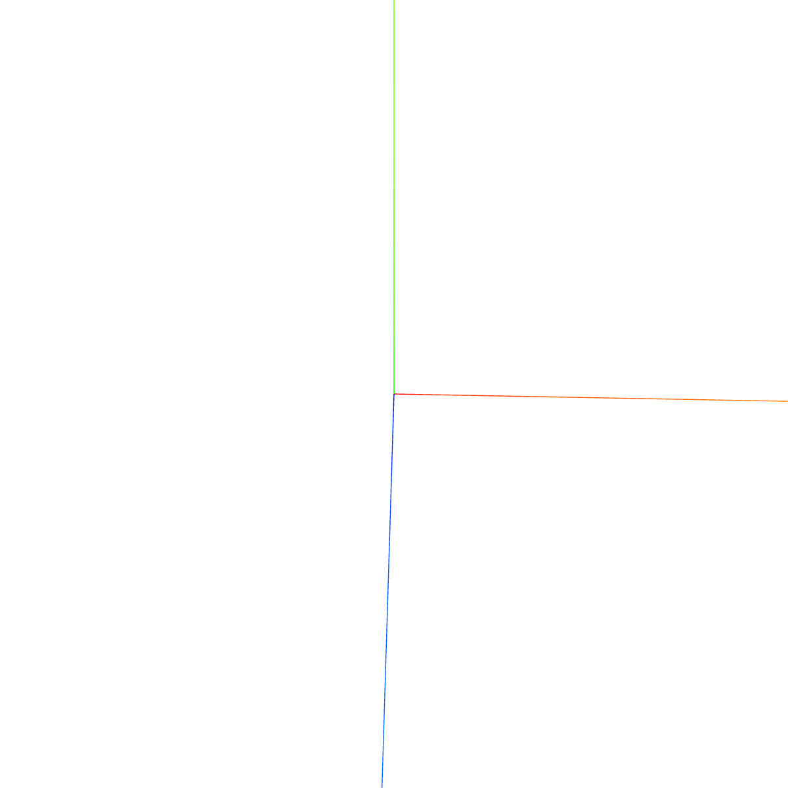
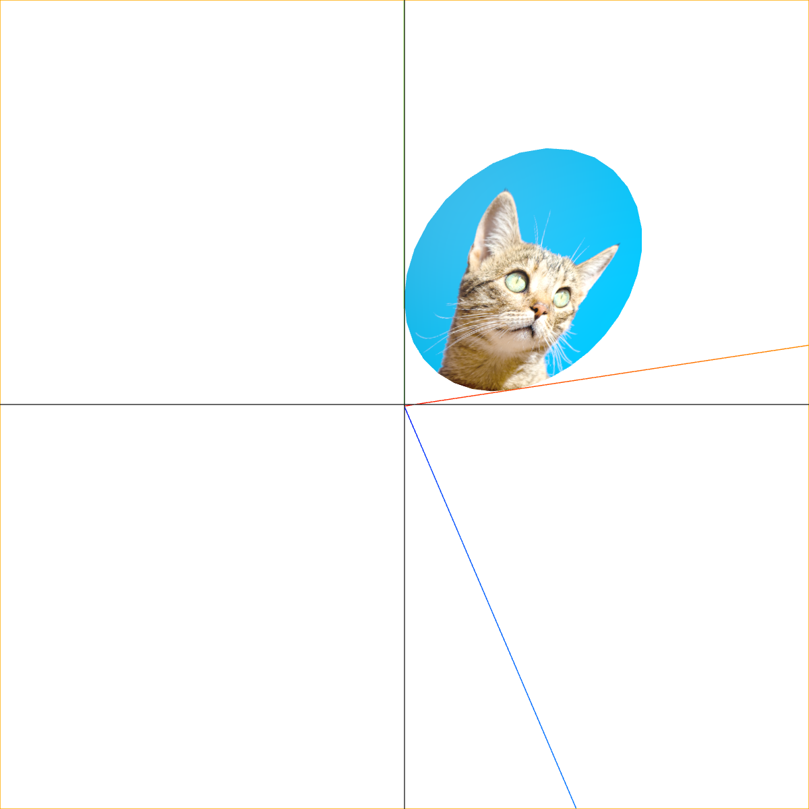
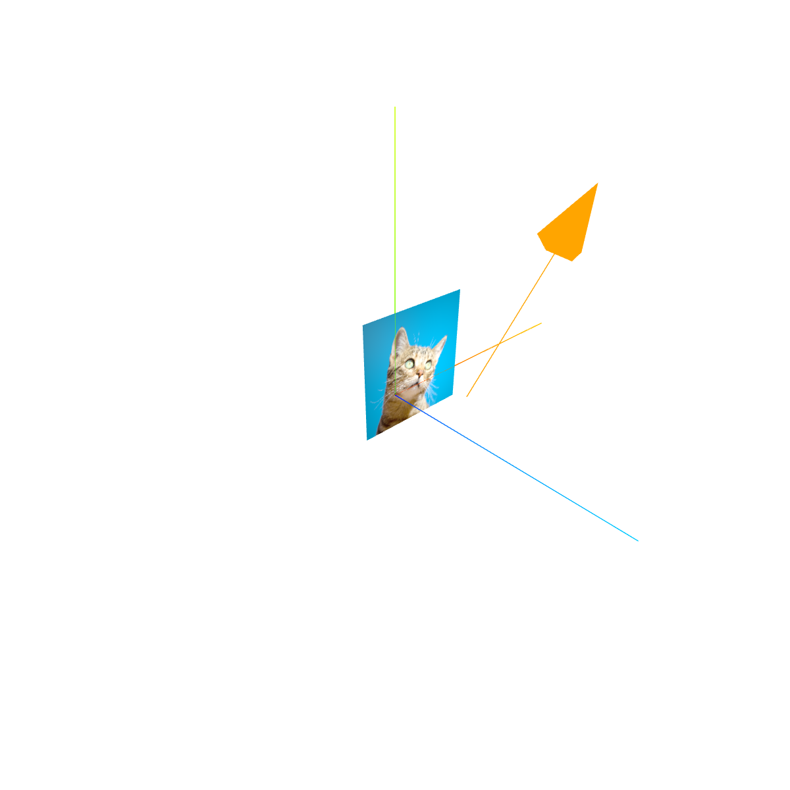

## 1. 地面网格辅助器
<table>
<tr>
<td  style="width:600px;max-width:600px;">

```tsx
// 直角坐标
// 尺寸、分成几格、xz轴网格颜色、其他网格颜色
constructor( size = 10, divisions = 10, color1 = 0x444444, color2 = 0x888888 ){
    // ...
}

// ...
const gridHelper = new THREE.GridHelper(500, 25, 'red', 0x00444);
scene.add(gridHelper);
// ...
```
</td>
<td style="min-width:260px"></td>
`</tr>

<tr>
<td  style="width:600px;max-width:600px;">

```tsx
// 极坐标
// 半径、一圈260°分成几份、圈(环)数、每圈分成几份来渲染（6就是六边形）、
constructor( radius = 10, sectors = 16, rings = 8, divisions = 64, color1 = 0x444444, color2 = 0x888888 ) {
    // ...
}

// ...
const polarGridHelper = new THREE.PolarGridHelper(500,20,8,64,'green','red');
scene.add(polarGridHelper);
// ...
```
</td>
<td></td>
`</tr>
</table>

## 2. 灯光辅助器
<table>
<tr>
<td  style="width:600px;max-width:600px;">

```tsx
// 平行光
const directionalLight = new THREE.DirectionalLight(0xffffff, 4);
directionalLight.position.set(200, 50, 500);
directionalLight.target = mesh;
scene.add(directionalLight);
const directionalLightHelper = new THREE.DirectionalLightHelper(directionalLight, 20, 0xff0000);
scene.add(directionalLightHelper);
```
</td>
<td style="min-width:260px"></td>
</tr>

<tr>
<td  style="width:600px;max-width:600px;">

```tsx
// 点光源，传入颜色、光强
const pointLight = new THREE.PointLight(0xffffff, 1000000);
pointLight.position.set(200,50,500);
scene.add(pointLight);
const pointLightHelper = new THREE.PointLightHelper(pointLight, 20, 0xff0000);
scene.add(pointLightHelper);
```
</td>
<td></td>
</tr>

</table>

## 3. 坐标轴辅助器
<table>
<tr>
<td  style="width:600px;max-width:600px;">

```tsx
// 传入长度
const axesHelper = new THREE.AxesHelper(1000);
scene.add(axesHelper);
```
</td>
<td style="min-width:260px"></td>
</tr>
</table>

## 4. 相机辅助器
<table>
<tr>
<td  style="width:600px;max-width:600px;">

```tsx
// 传入要辅助的相机
const cameraHelper = new THREE.CameraHelper(camera);
scene.add(cameraHelper);
```
</td>
<td style="min-width:260px"></td>
</tr>
</table>

## 5. 箭头辅助器
<table>
<tr>
<td  style="width:600px;max-width:600px;">

```tsx
// 方向(必须是单位向量)、起点坐标、长度、颜色、箭头部分长度、箭头部分宽度
constructor( dir = new Vector3( 0, 0, 1 ), origin = new Vector3( 0, 0, 0 ), length = 1, color = 0xffff00, headLength = length * 0.2, headWidth = headLength * 0.2 ) {
    // ...
}

// ...
let dir = new THREE.Vector3(1, 1, 0);
dir = dir.normalize();
const origin = new THREE.Vector3(200,0,200);
const arrowHelper = new THREE.ArrowHelper(dir, origin,1000,'orange', 300,200);
scene.add(arrowHelper);
```
</td>
<td style="min-width:260px"></td>
</tr>
</table>

:muscle: ... 以后再补充


