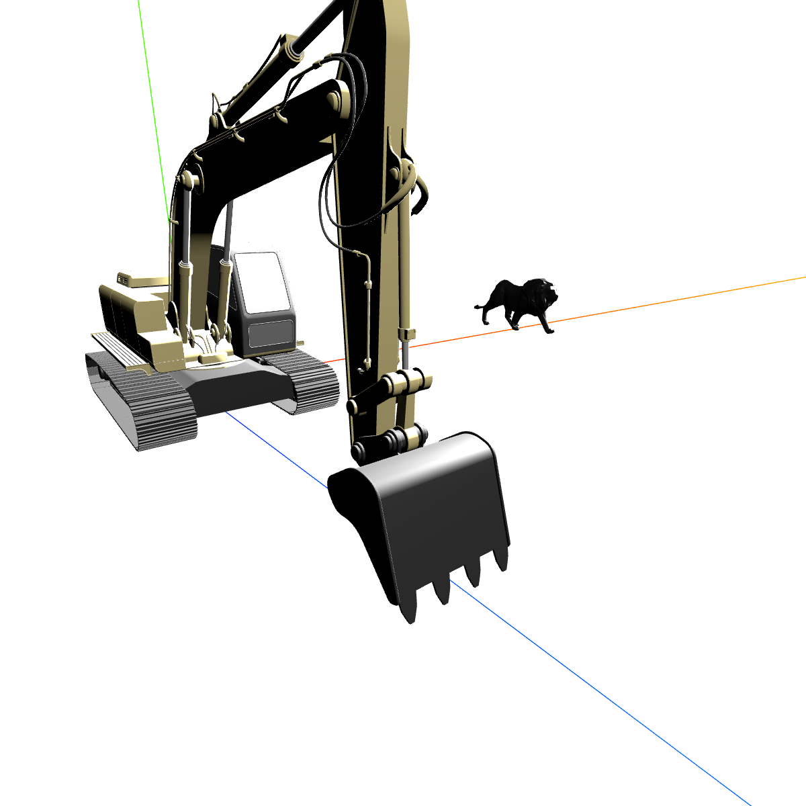
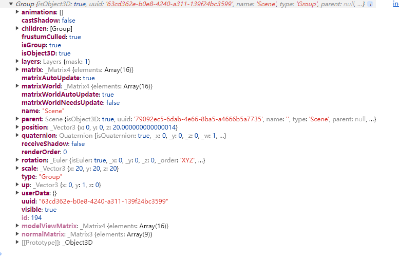
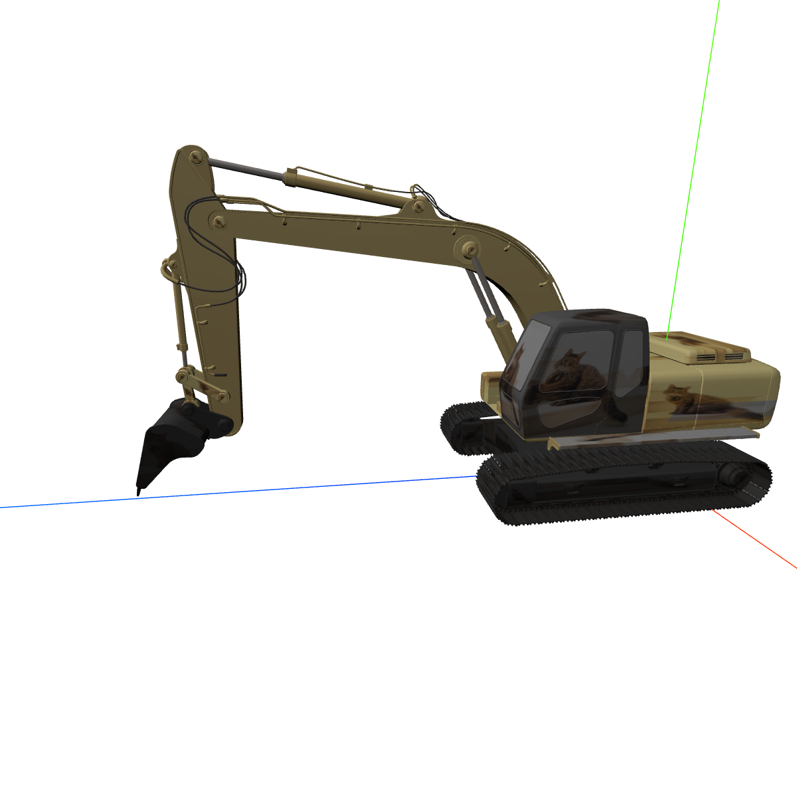

## 1. 例子
<table>
<tr>
<td style="width:600px;max-width:600px;">

```tsx
// ...
import { GLTFLoader } from 'three/addons/loaders/GLTFLoader';
// ...
const loader = new GLTFLoader();
let loadTarget1: any;
loader.load('/api/static/markdown/front-end/three/model/工程车.gltf', result => {
    loadTarget1 = result.scene;
    loadTarget1.position.set(0, 0, 0);
    loadTarget1.scale.set(20,20,20);
    scene.add(result.scene);
});
let loadTarget2: any;
loader.load('/api/static/markdown/front-end/three/model/雕塑狮子.gltf', result => {
    loadTarget2 = result.scene;
    loadTarget2.position.set(200, 0, 0);
    loadTarget2.scale.set(20,20,20);
    scene.add(result.scene);
});
// ...
function animate() {
    window.requestAnimationFrame(animate);
    loadTarget1 && (loadTarget1.position.z+=0.1);
    renderer.render(scene, camera);
}
animate();
// ...
```
</td>
<td style="min-width:260px"></td>
</tr>
</table>

- 加载得到的`result.scene`是个`Group`对象；



## 2. 补充
:ballot_box_with_check: 加载函数`load( url, onLoad, onProgress, onError ){}`；
:ballot_box_with_check: 加载进来的`result.scene`是个`Group`对象的实例，有多个三维对象(`Group`、`Mesh`、`Line`等)，之前得属性方法都能用；
:white_check_mark: 每个三维对象可能也有`geometry`、`material`和`children`等，其中`geometry`有`attributes`等、`material`有`color`、`map`等；
:white_check_mark: 可以对加载的模型进行平移、旋转、缩放、改材质、改坐标、改法向量等，`Group`里面可能没有`geometry`和`material`；
:white_check_mark: `model.scene.traverse(obj=>{})`遍历模型，对模型进行操作；
:white_check_mark: `getX(index)、getY(index)、getZ(index)`获取第index个点，还有`setX(index,x)、setY(index,y)、setZ(index,z)`；

<table>
<tr>
<td style="width:600px;max-width:600px">

```tsx
const loader = new GLTFLoader();
let loadTarget1: any;
loader.load('/api/static/markdown/front-end/three/model/工程车.gltf', result => {
    loadTarget1 = result.scene;
    loadTarget1.position.set(0, 0, 0);
    loadTarget1.scale.set(20, 20, 20);
    const textureLoader = new THREE.TextureLoader();
    textureLoader.load('/api/static/markdown/front-end/three/image/texture/猫-2.jpg', texture => {
        texture.colorSpace = THREE.SRGBColorSpace;
        // 纹理对象的翻转属性，加载进来的模型的子对象里面这个属性是false，而加载的纹理这个属性是true
        // 需要改成false，再赋值给模型，不然不显示
        texture.flipY = false;
        loadTarget1.traverse(obj => {
            if (obj.isMesh) {
                obj.material.map = texture;
            }
        });
        scene.add(result.scene);
    });
    // 要在回调中添加，不然这里写了没效果
    // scene.add(result.scene);
});
```
</td>
<td style="min-width:260px">猫猫挖掘机</td>
</tr>
</table>

