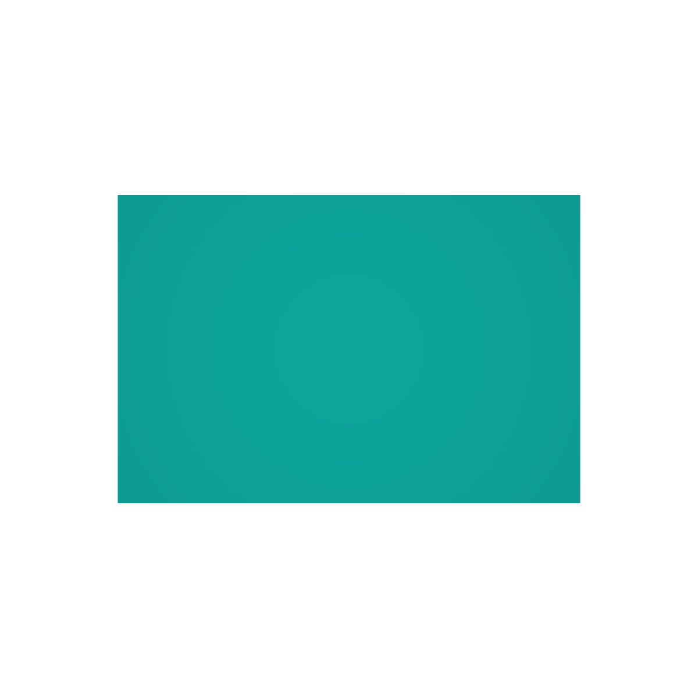

- `Physically-based redering`基于物理的渲染；
:ballot_box_with_check: 比如`MeshStandardMaterial`、`MeshPhysicalMaterial`，相比于`MeshLambertMaterial`和`MeshPhongMaterial`更真实、更接近生活中的材质效果、更占内存；

## 1. `MeshStandardMaterial`
:ballot_box_with_check: 除了`Material`共有的`color`、`map`、`transparent`、`opacity`、`side`、`visible`等属性外，`MeshStandardMaterial`还有`roughness`、`metalness`、`envMap`等属性；
:white_check_mark: 可以在初始化时配置，也可以之后配置或修改；
:white_check_mark: `metalness`金属度：表面像金属的程度，0-1之间，默认0.5；
:white_check_mark: `roughness`粗糙度，0.0镜面反射、1.0完全漫反射，默认0.5；

<table>
<tr style="width:600px;max-width:600px;" align="center">
<td>实现</td>
<td>效果</td>
</tr>

<tr style="width:600px;max-width:600px;" align="center">
<td>

```tsx
// ...
const geometry = new THREE.BoxGeometry(200, 200, 200);
const material = new THREE.MeshStandardMaterial({
    color: 0xff0000,
});
const mesh = new THREE.Mesh(geometry, material);
scene.add(mesh);

const pointLight = new THREE.PointLight(0xffffff, 6000000);
pointLight.position.set(500, 200, 500);
scene.add(pointLight);
// ...
```
</td>
<td></td>
</tr>

<tr>
<td>

```tsx
// ...
const material = new THREE.MeshStandardMaterial({
    color: 0xff0000,
    metalness: 1.0
});
// ...
```
</td>
<td></td>
</tr>

<tr>
<td>

```tsx
// ...
const material = new THREE.MeshStandardMaterial({
    color: 0xff0000
});
material.roughness=1.0;
// ...
```
</td>
<td></td>
</tr>

</table>

:white_check_mark: `envMap`环境贴图；
:zap: 和贴图`map`的区别：`map`受光照明暗影响；
- 场景`scene`的环境贴图
<table>
<tr>
<td style="width:600px;max-width:600px;" align="center">

```tsx
const cubeTextureLoader = new THREE.CubeTextureLoader();
const textureCube = cubeTextureLoader.setPath('/api/static/markdown/front-end/three/image/texture/')
.load(['w=557&h=50.jpg', '猫-1.jpg', '7060fda.jp.jpg', '猫-2.jpg', '卫星-6.jpg', '卫星-30.jpg']);
scene.background = textureCube;
// 也可以用RGBEloader加载比如hdr作为场景，也可以是颜色new THREE.Color(xxx);
```
</td>
<td></td>
</tr>
</table>

- 设置其他物体材质的场景贴图
    - 相关设置：`envMap`、`envMapIntensity`、`envMapRotation`等
<table>
<tr>
<td style="width:600px;max-width:600px;" align="center">

```tsx
const textureCube = cubeTextureLoader.setPath('/api/static/markdown/front-end/three/image/texture/').load(['w=557&h=50.jpg', '猫-1.jpg', '7060fda.jp.jpg', '猫-2.jpg', '卫星-6.jpg', '卫星-30.jpg']);
textureCube.colorSpace = THREE.SRGBColorSpace;
// textureCube.flipY=true; 可以上下翻转
const material = new THREE.MeshStandardMaterial({
    metalness:0.7,
    roughness:0.1,
    envMap: textureCube,
    envMapIntensity:2.0 // 越大越亮，直到完全白了
});
```
</td>
<td></td>
</tr>
</table>

## 2. `MeshPhysicalMaterial`
- 继承`MeshStandardMaterial`

:ballot_box_with_check: 其他属性
:white_check_mark: `clearcoat`、`clearcoatRoughness`，**用于车漆等**
|         属性         |                      说明                       |
| :------------------: | :---------------------------------------------: |
|     `clearcoat`      | 清漆层属性，0-1，模拟表面一层透明图层，用法同上 |
| `clearcoatRoughness` |                清漆层粗糙度，0-1                |

<table>
<tr>
<td>

```tsx
const material = new THREE.MeshPhysicalMaterial({
    color: 0xffff0,
    side: THREE.DoubleSide,
    metalness: 0.7,
    roughness: 1
});
```
</td>
<td></td>
</tr>

<tr>
<td>

```tsx
const material = new THREE.MeshPhysicalMaterial({
    color: 0xffff0,
    side: THREE.DoubleSide,
    metalness: 0.7,
    roughness: 1,
    clearcoat: 1,
});
```
</td>
<td></td>
</tr>

<tr>
<td>

```tsx
const material = new THREE.MeshPhysicalMaterial({
    color: 0xffff0,
    side: THREE.DoubleSide,
    metalness: 0.7,
    roughness: 1,
    clearcoat: 1,
    clearcoatRoughness: 0.2,
});
```
</td>
<td></td>
</tr>
</table>

:white_check_mark: `transmission`、`ior`，**用于玻璃等**
|      属性      |                   说明                   |
| :------------: | :--------------------------------------: |
| `transmission` |    透光率，代替`opacity`，0-1，默认0     |
|     `ior`      | 折射率，非金属折射率从1.0-2.333，默认1.5 |

<table>
<tr>
<td>

```tsx
const material = new THREE.MeshPhysicalMaterial({
    color: 0xffff0,
    side: THREE.DoubleSide,
    metalness: 0.9,
    roughness: 0.1,
});
```
</td>
<td></td>
</tr>

<tr>
<td>

```tsx
const material = new THREE.MeshPhysicalMaterial({
    color: 0xffff0,
    side: THREE.DoubleSide,
    metalness: 0.9,
    roughness: 0.1,
    transmission: 0.7
});
```
</td>
<td></td>
</tr>

<tr>
<td>

```tsx
const material = new THREE.MeshPhysicalMaterial({
    color: 0xffff0,
    side: THREE.DoubleSide,
    metalness: 0.9,
    roughness: 0.1,
    ior:0.1
});
```
</td>
<td></td>
</tr>
</table>


