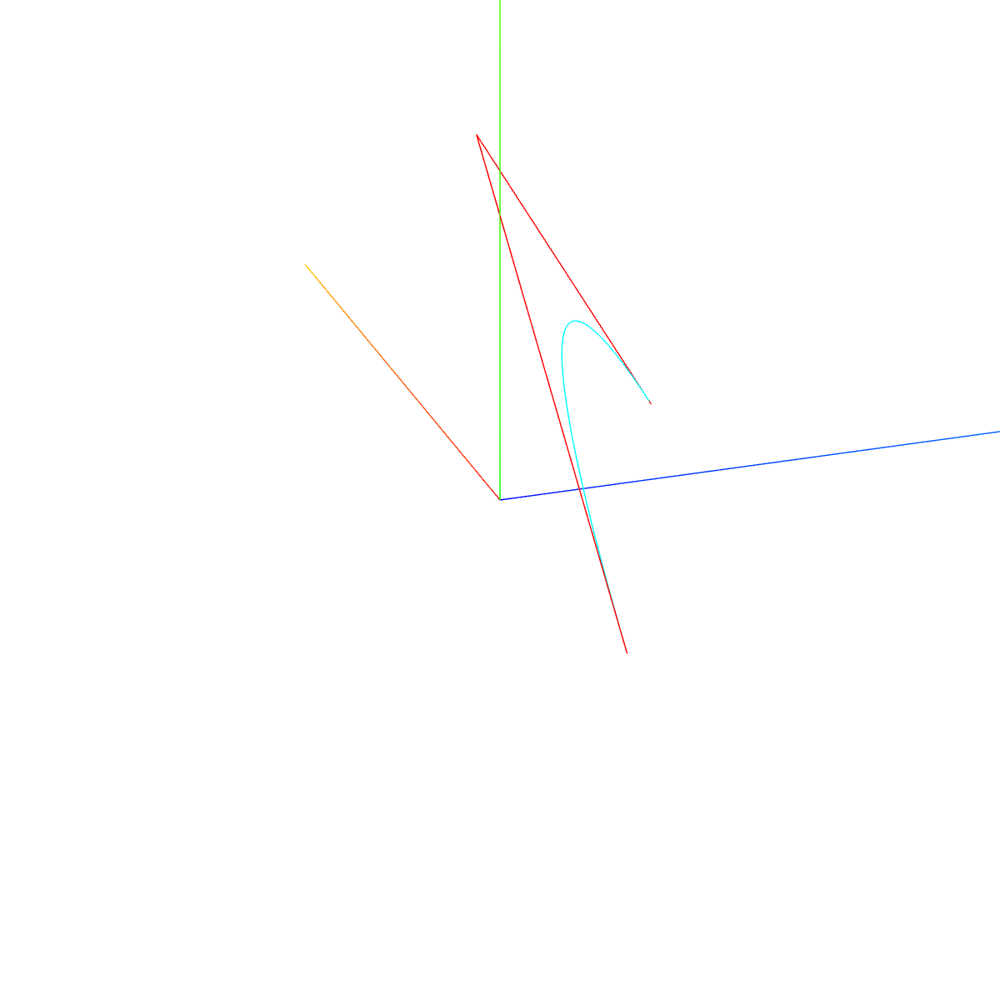

## 1. `setFromPoints(points)`

-   根据原始点生成简单曲线

```tsx
const pointsArr = [
    // 三维向量Vector3表示的坐标值
    new THREE.Vector3(0, 0, 0),
    new THREE.Vector3(0, 100, 0),
    new THREE.Vector3(0, 100, 100),
    new THREE.Vector3(0, 0, 100)
];
// 把数组pointsArr里面的坐标数据提取出来，赋值给`geometry.attributes.position`属性
geometry.setFromPoints(pointsArr);
console.log('几何体变化', geometry.attributes.position);
```

```tsx
const pointsArr = [
    // 三维向量Vector2表示的坐标值
    new THREE.Vector2(0, 0),
    new THREE.Vector2(100, 0),
    new THREE.Vector2(100, 100),
    new THREE.Vector2(0, 100)
];
geometry.setFromPoints(pointsArr);
```

## 2. 曲线`Curve`


<table>
<tr>
<td></td>
<td>

```tsx
// 二维直线
class LineCurve extends Curve {
    constructor(v1 = new Vector2(), v2 = new Vector2()) {
        super();
        // ...
    }
}

// 三维直线
class LineCurve3 extends Curve {
    constructor(v1 = new Vector3(), v2 = new Vector3()) {
        super();
        // ...
    }
}
```

</td>
<td rowspan="5">

```tsx
class Curve {
    constructor() {
        // ...
    }
    getPoints(division = 5) {} // 根据细分数等间距获取点，返回二维/三维向量组成的数组
    // 获取到之后可以通过setFromPoints(result)赋值给BufferGeometry实例
    getSpacedPoints(division = 5) {} // 根据细分数和斜率变化获取点，一阶导数绝对值越大则这个位置越密集，结果形式同上
    getLength() {} // 长度
    clone() {}
    copy(source) {}
    toJSON() {} // ...
}
```

</td>
</tr>

<tr>
<td>

```tsx
// 圆弧
class ArcCurve extends EllipseCurve {
    constructor(aX, aY, aRadius, aStartAngle, aEndAngle, aClockwise) {
        super(aX, aY, aRadius, aRadius, aStartAngle, aEndAngle, aClockwise);
        // ...
    }
}
```

</td>
<td>

```tsx
class EllipseCurve extends Curve {
    // 椭圆中心x、y、半长轴、半短轴、起始角度、结束角度、是否顺时针、旋转角度
    constructor(aX = 0, aY = 0, xRadius = 1, yRadius = 1, aStartAngle = 0, aEndAngle = Math.PI * 2, aClockwise = false, aRotation = 0) {
        super();
        // ...
    }
}
```

</td>
<td></td>
</tr>

<tr>
<td></td>
<td>

```tsx
// 样条曲线，空间中找Vector2或3，作为参数points，生成穿过这几个点的光滑曲线
// 二维样条曲线
class SplineCurve extends Curve {
    constructor(points = []) {
        super();
        // ...
    }
}

// 三维样条曲线
class CatmullRomCurve3 extends Curve {
    constructor(points = [], closed = false, curveType = 'centripetal', tension = 0.5) {
        super();
        // ...
    }
}
```

</td>
<td></td>
</tr>

<tr>
<td></td>
<td>

```tsx
// 二维二次贝塞尔曲线
class QuadraticBezierCurve extends Curve {
    constructor(v0 = new Vector2(), v1 = new Vector2(), v2 = new Vector2()) {
        super();
        // ...
    }
}

// 三维二次贝塞尔曲线
class QuadraticBezierCurve3 extends Curve {
    constructor(v0 = new Vector3(), v1 = new Vector3(), v2 = new Vector3()) {
        super();
        // ...
    }
}
```

</td>
<td></td>
</tr>

<tr>
<td></td>
<td>

```tsx
// 二维三次贝塞尔曲线
class CubicBezierCurve extends Curve {
    constructor(v0 = new Vector2(), v1 = new Vector2(), v2 = new Vector2(), v3 = new Vector2()) {
        super();
        // ...
    }
}

// 三维三次贝塞尔曲线
class CubicBezierCurve3 extends Curve {
    constructor(v0 = new Vector3(), v1 = new Vector3(), v2 = new Vector3(), v3 = new Vector3()) {
        super();
        // ...
    }
}
```

</td>
<td></td>
</tr>
</table>

:ballot_box_with_check: 思路：
:white_check_mark: 输入简单的点，通过曲线得到复杂的点，取出来，作为`BufferGeometry`的`.attributes.position`；
:one: 传入简单的点或向量，构造出这些曲线；
:two: 通过`getPoints(division)`或`getSpacePoints(division)`取出曲线中复杂的点；
:three: 通过`setFromPoints(points)`设为`BufferGeometry`的`position`；
:four: 设置`LineBasicMaterial`或`LineDashedMaterial`，`Line`或`LineLoop`或`LineSegments`；
:five: 设置`position`，`add`到场景中；

## 3. 样条曲线、贝塞尔曲线

:ballot_box_with_check: 应用：根据点的坐标展示轨迹弧线等；

:white_check_mark: 样条曲线

<table>
<tr>
<td style="width:600px;max-width:600px">

```tsx
const arr = [
    new THREE.Vector3(-50, 20, 90),
    new THREE.Vector3(-10, 40, 40),
    new THREE.Vector3(0, 0, 0),
    new THREE.Vector3(60, -60, 0),
    new THREE.Vector3(70, 0, 80)
];
// 三维样条曲线
const curve = new THREE.CatmullRomCurve3(arr, true);

const geometry = new THREE.BufferGeometry();
geometry.setFromPoints(curve.getPoints(50));
const material = new THREE.LineBasicMaterial({
    color: 0x00ffff
});
const line = new THREE.Line(geometry, material);
scene.add(line);
```

</td>
<td style="min-width:260px"></td>
</tr>

<tr>
<td>

```tsx
// ...
const material = new THREE.PointsMaterial({
    color: 0x00ffff,
    size: 6
});
const points = new THREE.Points(geometry, material);
scene.add(points);
```

</td>
<td></td>
</tr>

<tr>
<td>

```tsx
// ...
const geometry = new THREE.BufferGeometry();
geometry.setFromPoints(curve.getPoints(50));
const material = new THREE.MeshBasicMaterial({
    color: 0x00ffff
});
const mesh = new THREE.Mesh(geometry, material);
scene.add(mesh);
```

</td>
<td></td>
</tr>
</table>

:white_check_mark: 贝塞尔曲线

<table>
<tr>
<td style="width:600px;max-width:600px">

```tsx
const p1 = new THREE.Vector2(-80, 0);
const p2 = new THREE.Vector2(20, 100);
const p3 = new THREE.Vector2(80, 0);
// 二维二次贝塞尔曲线，与p12、p23相切
const curve = new THREE.QuadraticBezierCurve(p1, p2, p3);
const geometry = new THREE.BufferGeometry();
geometry.setFromPoints(curve.getPoints(100));
const material = new THREE.LineBasicMaterial({
    color: 0x00ffff
});
const line = new THREE.Line(geometry, material);
scene.add(line);

// 两条线段
const geometry1 = new THREE.BufferGeometry();
geometry1.setFromPoints([p1, p2, p3]);
const material1 = new THREE.LineBasicMaterial({
    color: 'red'
});
const line1 = new THREE.Line(geometry1, material1);
scene.add(line1);
// ...
```

</td>
<td style="min-width:260px"></td>
</tr>

<tr>
<td>

```tsx
// ...
const p1 = new THREE.Vector3(-80, 0, 0);
const p2 = new THREE.Vector3(20, 100, 0);
const p3 = new THREE.Vector3(80, 0, 100);
// 三维二次
const curve = new THREE.QuadraticBezierCurve3(p1, p2, p3);
// ...
```

</td>
<td></td>
</tr>

<tr>
<td>

```tsx
// ...
const p1 = new THREE.Vector2(-80, 0);
const p2 = new THREE.Vector2(20, 100);
const p3 = new THREE.Vector2(80, 0);
// 二维三次，比二维二次多了一个控制点
const curve = new THREE.CubicBezierCurve(p1, p2, p3);
// ...
```

</td>
<td></td>
</tr>

<tr>
<td>

```tsx
// ...
const p1 = new THREE.Vector3(-80, 0, 0);
const p2 = new THREE.Vector3(20, 100, 0);
const p3 = new THREE.Vector3(80, 0, 100);
// 三维三次
const curve = new THREE.CubicBezierCurve3(p1, p2, p3);
// ...
```

</td>
<td></td>
</tr>
</table>

## 4. 拼接

```tsx
class Curve extends Curve {
    constructor() {
        super();
        // ...
    }
    add(curve) {} // 添加曲线
    closePath() {} // 闭合，前后对getLength()有影响
    getLength() {}
    getCurveLengths() {} // 每个部分的长度数组，若闭合也算进去
    getPoints(divisions = 12) {}
    getSpacedPoints(divisions = 40) {}
    copy(source) {}
    toJSON() {}
}
```

<table>
<tr>
<td style="width:600px;max-width:600px">

```tsx
const R = 80; //圆弧半径
const H = 200; //直线部分高度
// 直线1
const line1 = new THREE.LineCurve(new THREE.Vector2(R, H), new THREE.Vector2(R, 0));
// 圆弧
const arc = new THREE.ArcCurve(0, 0, R, 0, Math.PI, true);
// 直线2
const line2 = new THREE.LineCurve(new THREE.Vector2(-R, 0), new THREE.Vector2(-R, H));

// CurvePath创建一个组合曲线对象
const CurvePath = new THREE.CurvePath();
//line1, arc, line2拼接出来一个U型轮廓曲线，注意顺序
CurvePath.curves.push(line1, arc, line2);
// 或者
// [line1, arc, line2].forEach(line=>{
//     CurvePath.add(line)
// });

// 执行.getPoints()，直线部分不会像曲线返回中间多余点，只需要起始点即可。
const pointsArr = CurvePath.getPoints(16); //曲线上获取点
const geometry = new THREE.BufferGeometry();
geometry.setFromPoints(pointsArr); //读取坐标数据赋值给几何体顶点

// 可视化curve.getPoints从曲线上获取的点坐标
const material2 = new THREE.LineBasicMaterial({
    color: 0xff00ff,
    size: 10
});
//点模型对象
const line = new THREE.Line(geometry, material2);
scene.add(line);
```

</td>
<td style="min-width:260px"></td>
</tr>
</table>

## 5. 曲线路径管道

:ballot_box_with_check: `TubeGeometry`；

```tsx
class TubeGeometry extends BufferGeometry {
    // path扫描路径（三维曲线，可以是生成的曲线，也可以多个曲线组合）、tubularSegments路径方向细分数、radius管道半径、radiusSegments管道圆弧细分数、closed管道是否闭合
    constructor(
        path = new Curves['QuadraticBezierCurve3'](new Vector3(-1, -1, 0), new Vector3(-1, 1, 0), new Vector3(1, 1, 0)),
        tubularSegments = 64,
        radius = 1,
        radialSegments = 8,
        closed = false
    ) {
        super();
    }
}
```

<table>
<tr>
<td style="width:600px;max-width:600px">

```tsx
// 三维样条曲线
const path = new THREE.CatmullRomCurve3([
    new THREE.Vector3(-50, 20, 90),
    new THREE.Vector3(-10, 40, 40),
    new THREE.Vector3(0, 0, 0),
    new THREE.Vector3(60, -60, 0),
    new THREE.Vector3(70, 0, 80)
]);

// path:路径   40：沿着轨迹细分数  2：管道半径   25：管道截面圆细分数
const geometry = new THREE.TubeGeometry(path, 40, 10, 25);
const material = new THREE.MeshLambertMaterial({
    side: THREE.DoubleSide //双面显示看到管道内壁
});
const mesh = new THREE.Mesh(geometry, material);
scene.add(mesh);
```

</td>
<td style="min-width:260px"></td>
</tr>

<tr>
<td>

```tsx
// ...
const geometry = new THREE.TubeGeometry(path, 4, 10, 25);
// ...
```

</td>
<td></td>
</tr>

<tr>
<td>

```tsx
// ...
const geometry = new THREE.TubeGeometry(path, 40, 30, 25);
// ...
```

</td>
<td></td>
</tr>

<tr>
<td>

```tsx
// ...
const geometry = new THREE.TubeGeometry(path, 40, 10, 4);
// ...
```

</td>
<td></td>
</tr>
</table>

## 6. 旋转成型

:ballot_box_with_check: `LatheGeometry`；逆时针；
:white_check_mark: 传入二维向量数组，生成绕`y`轴旋转的模型；

```tsx
class LatheGeometry extends BufferGeometry {
    // 坐标数组、圆周方向细分数、开始角度、角度跨度
    constructor(points = [new Vector2(0, -0.5), new Vector2(0.5, 0), new Vector2(0, 0.5)], segments = 12, phiStart = 0, phiLength = Math.PI * 2) {
        super();
    }
}
```

<table>
<tr>
<td style="width:600px;max-width:600px">

```tsx
const pointsArr = [new THREE.Vector2(50, 60), new THREE.Vector2(25, 0), new THREE.Vector2(50, -60)];
const geometry = new THREE.LatheGeometry(pointsArr);
const material = new THREE.MeshBasicMaterial({
    color: 0x00ffff,
    side: THREE.DoubleSide // 记得开双面
});
const mesh = new THREE.Mesh(geometry, material);
scene.add(mesh);
```

</td>
<td></td>
</tr>

<tr>
<td>

```tsx
const segments = 4;
const geometry = new THREE.LatheGeometry(pointsArr, segments);
```

</td>
<td></td>
</tr>

<tr>
<td>

```tsx
const segments = 4;
const phiStart = Math.PI / 2;
const phiLength = (Math.PI * 5) / 4;
const geometry = new THREE.LatheGeometry(pointsArr, segments, phiStart, phiLength);
```

</td>
<td></td>
</tr>

<tr>
<td>

```tsx
const pointsArr = [new THREE.Vector2(50, 60), new THREE.Vector2(25, 0), new THREE.Vector2(50, -60), new THREE.Vector2(0, -100)];
```

</td>
<td></td>
</tr>
</table>

## 7. 轮廓填充

:ballot_box_with_check: `ShapeGeometry`；
:white_check_mark: 根据点坐标生成轮廓(`Shape`)，再根据轮廓生成填充体；

```tsx
class ShapeGeometry extends BufferGeometry {
    constructor(shapes = new Shape([new Vector2(0, 0.5), new Vector2(-0.5, -0.5), new Vector2(0.5, -0.5)]), curveSegments = 12) {
        super();
    }
}
```

<table>
<tr>
<td style="width:600px;max-width:600px">

```tsx
const pointsArr = [new THREE.Vector2(-50, -50), new THREE.Vector2(-60, 0), new THREE.Vector2(0, 50), new THREE.Vector2(60, 0), new THREE.Vector2(50, -50)];
// 轮廓
const shape = new THREE.Shape(pointsArr);
// 轮廓填充几何体
const geometry = new THREE.ShapeGeometry(shape);
const material = new THREE.MeshBasicMaterial({
    color: 0x00ffff,
    side: THREE.DoubleSide
});
const mesh = new THREE.Mesh(geometry, material);
scene.add(mesh);
```

</td>
<td style="min-width:260px"></td>
</tr>

<tr>
<td>

```tsx
// 材质设置
wireframe: true;
```

</td>
<td></td>
</tr>
</table>

## 8. 拉伸

:ballot_box_with_check: `ExtrudeGeometry`；
:white_check_mark: 根据点坐标生成轮廓(`Shape`)，再根据轮廓生成拉伸体；

```tsx
class ExtrudeGeometry extends BufferGeometry {
    constructor(shapes = new Shape([new Vector2(0.5, 0.5), new Vector2(-0.5, 0.5), new Vector2(-0.5, -0.5), new Vector2(0.5, -0.5)]), options = {}) {
        super();
    }
}
```

-   沿直线拉伸
<table>
<tr>
<td style="width:600px;max-width:600px">

```tsx
const pointsArr = [new THREE.Vector2(-50, -50), new THREE.Vector2(-60, 0), new THREE.Vector2(0, 50), new THREE.Vector2(60, 0), new THREE.Vector2(50, -50)];
const shape = new THREE.Shape(pointsArr);
const geometry = new THREE.ExtrudeGeometry(shape, {
    depth: 100
});
const material = new THREE.MeshBasicMaterial({
    color: 0x00ffff,
    side: THREE.DoubleSide
});
const mesh = new THREE.Mesh(geometry, material);
scene.add(mesh);
```

</td>
<td style="min-width:260px"></td>
</tr>

<tr>
<td>

```tsx
// 材质
wireframe: true;
```

</td>
<td></td>
</tr>

<tr>
<td>

```tsx
const geometry = new THREE.ExtrudeGeometry(shape, {
    depth: 100,
    bevelThickness: 20, //倒角尺寸:拉伸方向
    bevelSize: 10, //倒角尺寸:垂直拉伸方向
    bevelSegments: 1 //倒圆角：倒角细分精度，默认3
});
// ...
```

</td>
<td></td>
</tr>

<tr>
<td>

```tsx
// 配置
bevelEnabled: false, //禁止倒角,默认true
```

</td>
<td></td>
</tr>
</table>

-   沿曲线拉伸（扫描）

<table>
<tr>
<td style="width:600px;max-width:600px">

```tsx
const pointsArr = [new THREE.Vector2(-50, -50), new THREE.Vector2(-60, 0), new THREE.Vector2(0, 50), new THREE.Vector2(60, 0), new THREE.Vector2(50, -50)];
const curve = new THREE.CatmullRomCurve3([
    new THREE.Vector3(-10, -50, -50),
    new THREE.Vector3(10, 0, 0),
    new THREE.Vector3(8, 50, 50),
    new THREE.Vector3(-5, 0, 100)
]);
const shape = new THREE.Shape(pointsArr);
const geometry = new THREE.ExtrudeGeometry(
    shape, //扫描轮廓
    {
        extrudePath: curve, //扫描轨迹
        steps: 500 //沿着路径细分精度，越大越光滑
    }
);
const material = new THREE.MeshBasicMaterial({
    color: 0x00ffff,
    side: THREE.DoubleSide,
    wireframe: true
});
const mesh = new THREE.Mesh(geometry, material);
scene.add(mesh);
```

</td>
<td></td>
</tr>

<tr>
<td>

```tsx
steps: 10;
```

</td>
<td></td>
</tr>
</table>
