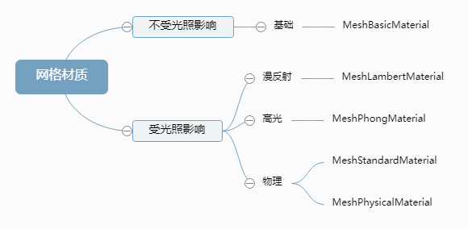
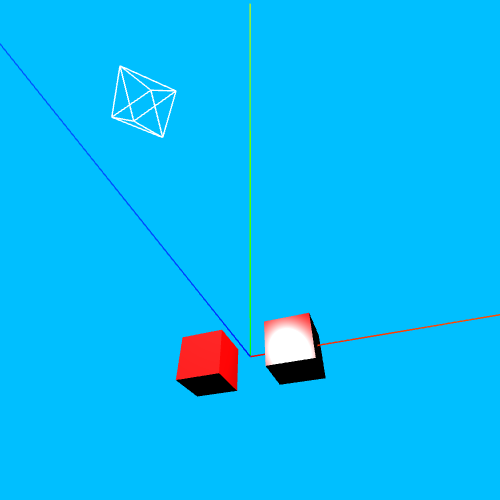
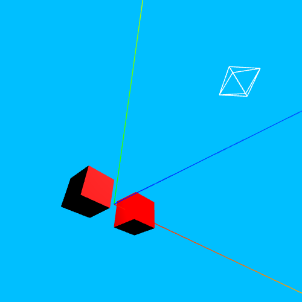
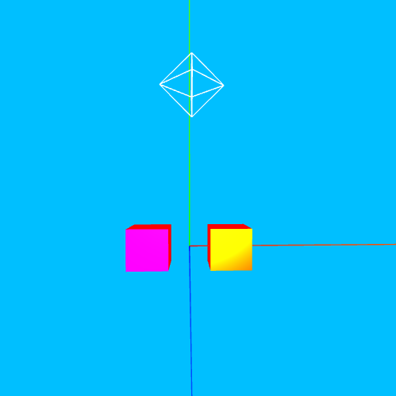
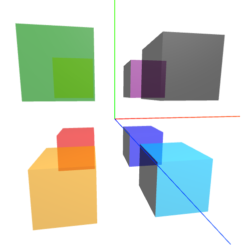
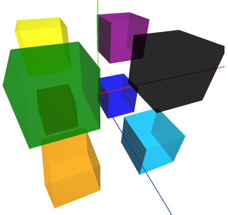
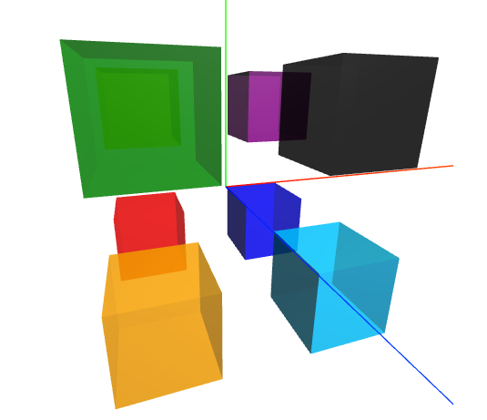

## 1. 分类


| 分类 | 描述 | 属性 |
| :-------------------: | :----------------------: | :-------------------------------------------------: |
| `MeshPhongMaterial` | 镜面反射 | `shininess`(高光亮度，默认 20)、`specular`(高光颜色) |
| `MeshLambertMaterial` | 朗伯体，各向同性，漫反射 | |

## 2. `MeshPhongMaterial`效果

-   材质不传颜色不显示
<table>
<tr>
<td>属性</td>
<td>效果</td>
<td>描述</td>
</tr>

<tr>
<td rowspan="2">

`shininess`

</td>
<td></td>
<td>右边400</td>
</tr>

<tr>
<td></td>
<td>左边0</td>
</tr>

<tr>
<td>

`specular`

</td>
<td></td>
<td>

左边`blue`<br/>
右边`green`

</td>
</tr>
</table>

## 3. 类的定义

<table>
<tr>
<td></td>
<td>

```tsx
class MeshBasicMaterial extends Material {
    constructor(parameters) {
        super();
        // ...
    }
}
```

</td>
<td rowspan="5">

```tsx
class Material extends EventDispatcher {
    constructor() {
        super();
        // ...
    }
}
```

</td>
</tr>

<tr>
<td></td>
<td>

```tsx
class MeshLambertMaterial extends Material {
    constructor(parameters) {
        super();
        // ...
    }
}
```

</td>
</tr>

<tr>
<td></td>
<td>

```tsx
class MeshPhongMaterial extends Material {
    constructor(parameters) {
        super();
        // ...
    }
}
```

</td>
</tr>

<tr>
<td>

```tsx
class MeshPhysicalMaterial extends MeshStandardMaterial {
    constructor(parameters) {
        super();
        // ...
    }
}
```

</td>
<td>

```tsx
class MeshStandardMaterial extends Material {
    constructor(parameters) {
        super();
        // ...
    }
}
```

</td>
</tr>
</table>

## 4. 配置(`parameters`)

-   `color`；
-   `transparent`，true 时开启透明；
-   `opacity`，设置不透明度，配合`transparent`用；
-   `side`，前/后/双面显示(`THREE.FrontSide`(默认)、`THREE.BackSide`、`THREE.DoubleSide`)，用`MeshBasicMaterial`没棱角；
-   `wireframe`表示是否显示长、宽、高、半径等分成的份数，而不是显示`Mesh`，只有`Mesh`有这个配置，点和线没有；
-   没效果或不显示的时候，多调一调参数；
-   <span style="font-size:20px;font-weight:bolder;color:red">后续补充中...</span>

## 5. 例子

```tsx
const geometry = new THREE.BoxGeometry(100, 100, 100);
function createMesh(geometry: any, x: number, y: number, z: number, color: string, side: string = '') {
    const drawMesh = (side: any) => {
        const material = new THREE.MeshPhongMaterial({ color, transparent: true, opacity: 0.6, side });
        const mesh = new THREE.Mesh(geometry, material);
        mesh.position.set(x, y, z);
        scene.add(mesh);
    };
    if (side === 'DoubleSide') {
        // 如果前后都要画
        // 先后后前，不然对于深度大于先前被记录的像素，将不会被绘制
        drawMesh(THREE.BackSide);
        drawMesh(THREE.FrontSide);
    } else {
        drawMesh(side);
    }
}
const colorArr = ['red', 'orange', 'yellow', 'green', 'blue', 'deepskyblue', 'purple', 'black'];
let num = 0;
for (let x = -100; x <= 100; x += 200) {
    for (let y = -100; y <= 100; y += 200) {
        for (let z = -100; z <= 100; z += 200) {
            const color = colorArr[num++];
            createMesh(geometry, x, y, z, color, 'DoubleSide');
        }
    }
}
```

|           配置            |           效果            |                     说明                     |
| :-----------------------: | :-----------------------: | :------------------------------------------: |
|     默认(`FrontSide`)     |  |                                              |
|       `DoubleSide`        |  | 没被遮挡的地方前后都有，被遮挡的地方只有前面 |
| 先`BackSide`后`FrontSide` |  |                                              |
