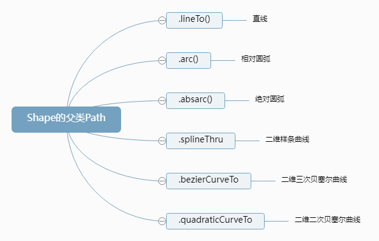
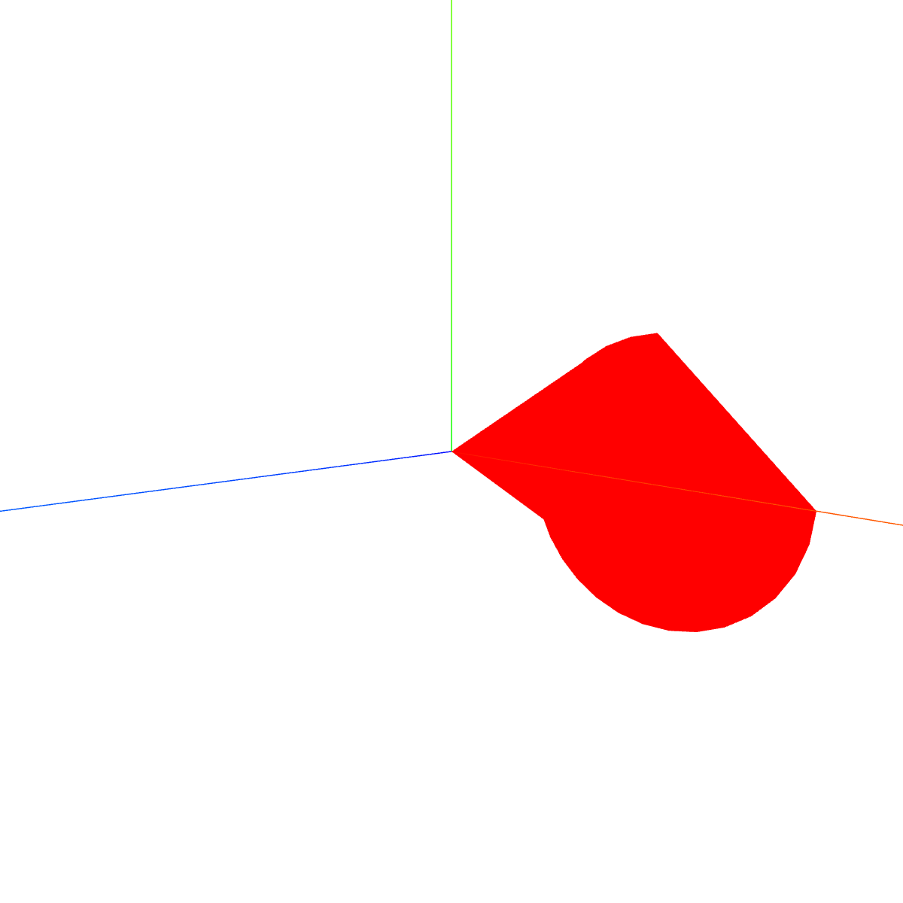
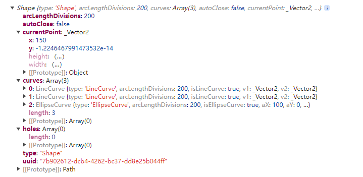
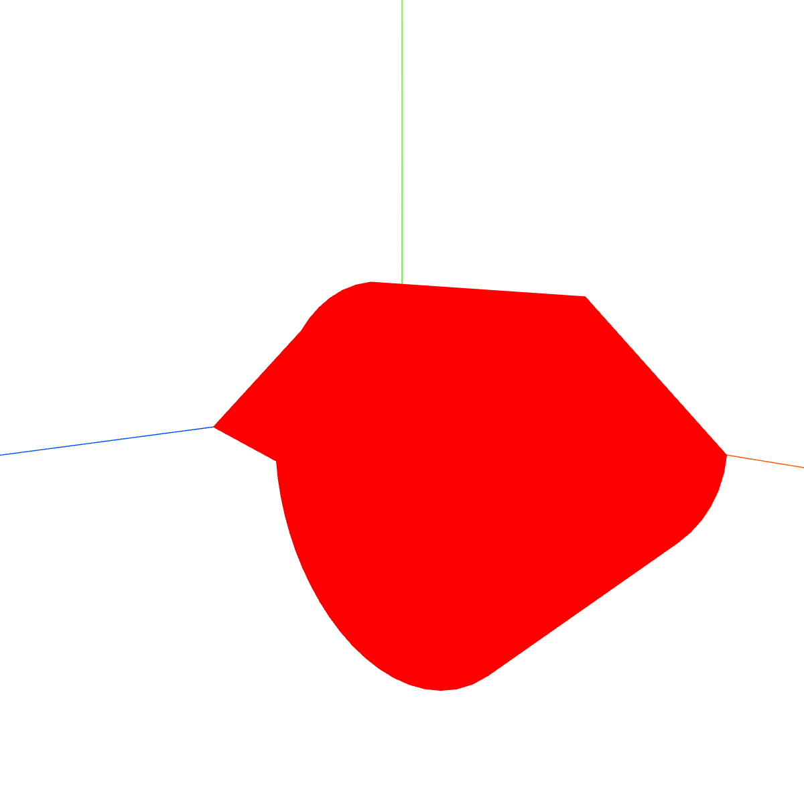
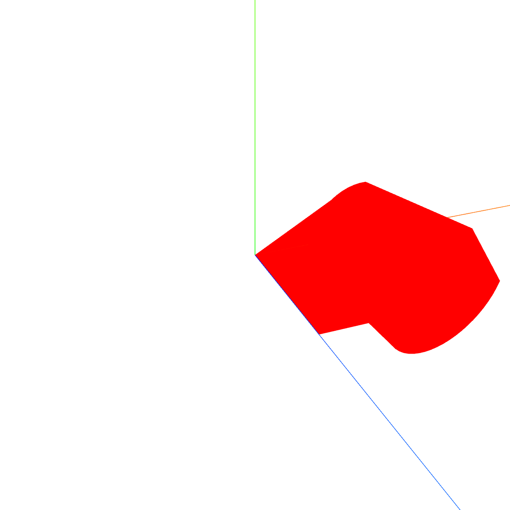
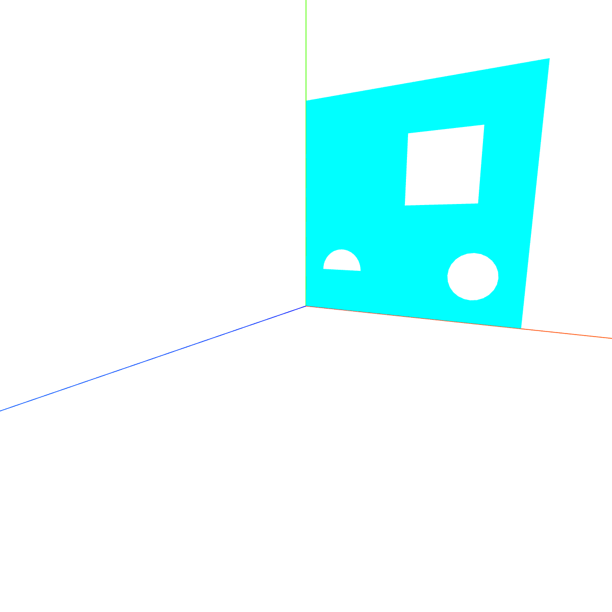
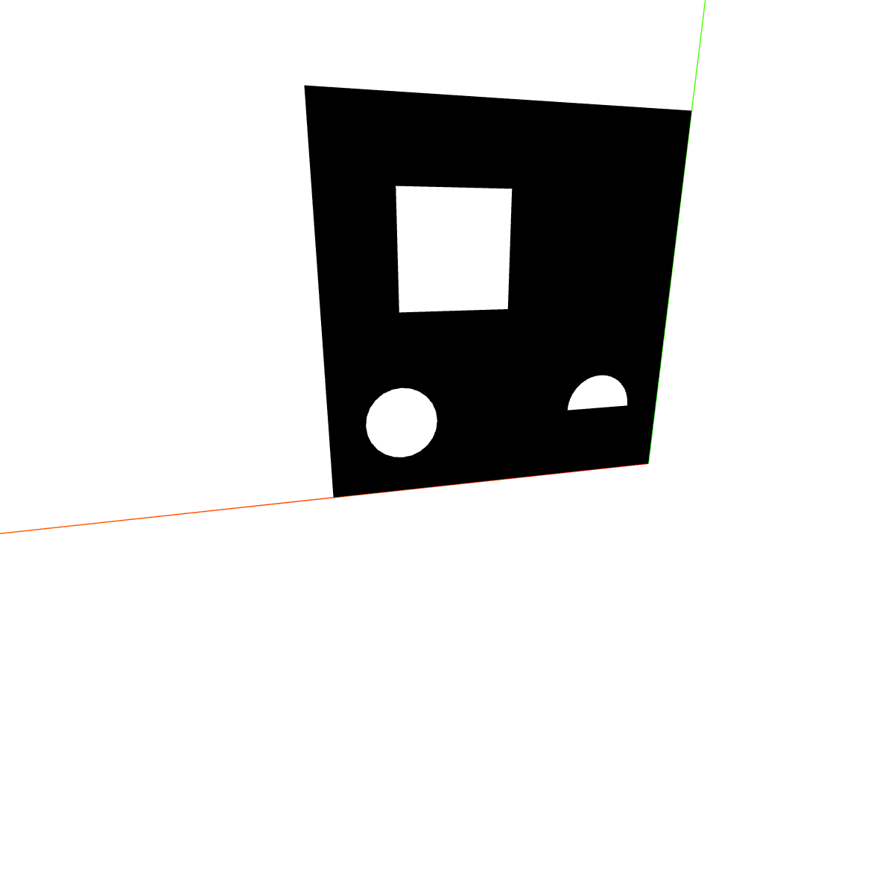
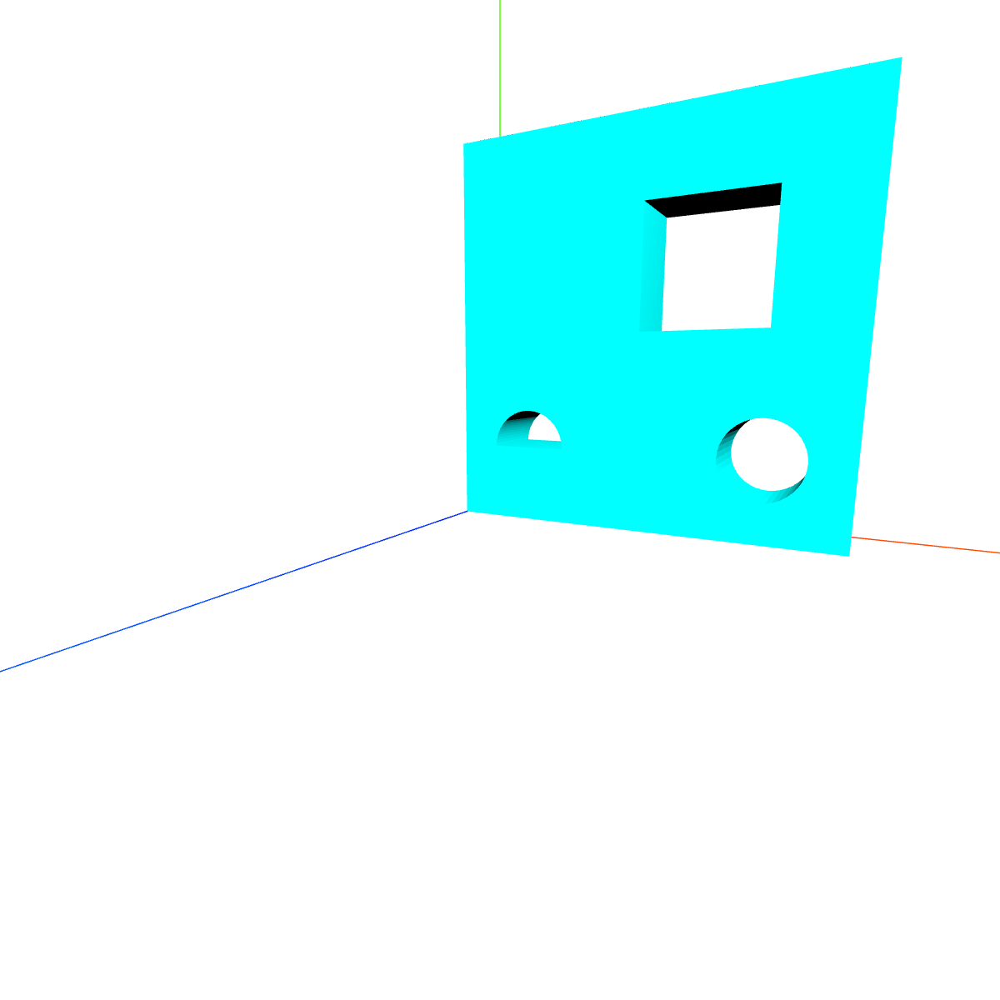
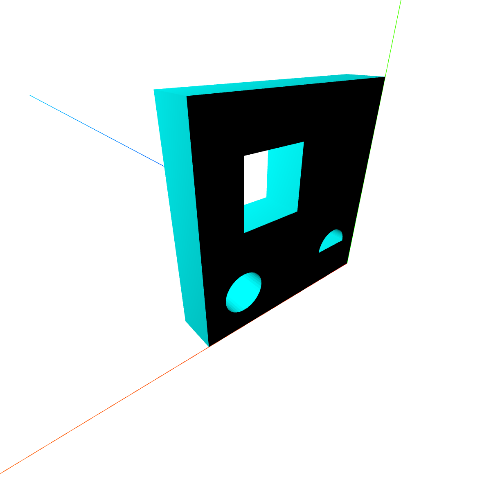

## 1. 概念

- 轮廓
- 继承自`Path` => `CurvePath` => `Curve`
- `shape`既可以通过给`new THREE.Shape()`传入点数组生成，也可以先生成空的，再用以下方法绘制；
- 用处：`new THREE.ShapeGeometry(shape)`、`new THREE.ExtrudeGeometry(shape)`等；
- `Path`的一些方法：
  

<table>
<tr>
<td>

```tsx
class Shape extends Path {
  constructor(points) {
    super()
    // ...
    this.holes = []
  }
  getPointsHoles(divisions) {}
  extractPoints(divisions) {}
  copy(source) {}
  toJSON() {}
  fromJSON(json) {}
}
```

</td>
<td>

```tsx
class Path extends CurvePath {
  constructor(points) {
    super()
    // ...
    this.currentPoint // 当前点，默认Vector2(0,0)
  }
  setFromPoints(points) {}
  moveTo(x, y) {} // 移动
  lineTo(x, y) {} // 传终点，从currentPoint起画直线
  quadraticCurveTo(aCPx, aCPy, aX, aY) {}
  bezierCurveTo(aCP1x, aCP1y, aCP2x, aCP2y, aX, aY) {}
  splineThru(pts) {}
  arc(aX, aY, aRadius, aStartAngle, aEndAngle, aClockwise) {} // aX和aY是相对于currentPoint的坐标
  absarc(aX, aY, aRadius, aStartAngle, aEndAngle, aClockwise) {} // 以原点为中心的坐标
  ellipse(aX, aY, xRadius, yRadius, aStartAngle, aEndAngle, aClockwise, aRotation) {}
  absellipse(aX, aY, xRadius, yRadius, aStartAngle, aEndAngle, aClockwise, aRotation) {}
  copy(source) {}
  toJSON() {}
  fromJSON(json) {}
}
```

</td>
<td>

```tsx
class CurvePath extends Curve {
  constructor() {
    super()
    // ...
  }
  add(curve) {}
  closePath() {}
  getPoint(t, optionalTarget) {}
  getLength() {}
  updateArcLengths() {}
  getCurveLengths() {}
  getSpacedPoints(divisions = 40) {}
  getPoints(divisions = 12) {}
  copy(source) {}
  toJSON() {}
  fromJSON(json) {}
}
```

</td>
<td>

```tsx
class Curve {
  constructor() {
    // ...
  }
  getPointAt(u, optionalTarget) {}
  getPoints(divisions = 5) {}
  getSpacedPoints(divisions = 5) {}
  getLength() {}
  // ...
}
```

</td>
</tr>
</table>

## 2. 例子

### 2..1 生成`shape`传入`ShapeGeometry`和`ExtrudeGeometry`

<table>
<tr>
<td style="width:600px;max-width:600px">

```tsx
const shape = new THREE.Shape()
shape.lineTo(150, 0)
shape.arc(-50, 0, 50, Math.PI / 2)
console.log(shape)
const geometry = new THREE.ShapeGeometry(shape)
const material = new THREE.MeshBasicMaterial({ color: 'red' })
const mesh = new THREE.Mesh(geometry, material)
scene.add(mesh)
```

</td>
<td></td>
</tr>

<tr>
<td>

```tsx
const geometry = new THREE.ExtrudeGeometry(shape, {
  depth: 100, // 拉伸长度
  bevelEnabled: false, // 进制倒角
  curveSegments: 20 // shape细分数
})
// 注意双面
const material = new THREE.MeshBasicMaterial({ color: 'red', side: THREE.DoubleSide })
// ...
```

</td>
<td></td>
</tr>
</table>

### 2..2 内孔
- `.holes`属性

<table>
<tr>
<td style="width:600px;max-width:600px">

```tsx
const shape = new THREE.Shape();
shape.lineTo(100, 0);
shape.lineTo(100, 100);
shape.lineTo(0, 100);
// 孔洞，这里用Shape也是可以的
const path1 = new THREE.Path();
path1.absarc(20, 20, 10,0,Math.PI);
const path2 = new THREE.Path(); // 圆孔2
path2.absarc(80, 20, 10);
const path3 = new THREE.Path(); // 方形孔
path3.moveTo(50, 50);
path3.lineTo(80, 50);
path3.lineTo(80, 80);
path3.lineTo(50, 80);
shape.holes.push(path1, path2, path3);

const geometry = new THREE.ExtrudeGeometry(shape, {
    depth: 20, // 拉伸长度
    bevelEnabled: false, // 进制倒角
    curveSegments: 20, // shape细分数
});
const material = new THREE.MeshBasicMaterial({ color: 'cyan' });
const mesh = new THREE.Mesh(geometry, material);
scene.add(mesh);
```
</td>
<td style="min-width:260px"></td>
</tr>

<tr>
<td>

```tsx
const geometry = new THREE.ExtrudeGeometry(shape, {
    depth: 20, // 拉伸长度
    bevelEnabled: false, // 进制倒角
    curveSegments: 20, // shape细分数
});
```
</td>
<td></td>
</tr>
</table>


