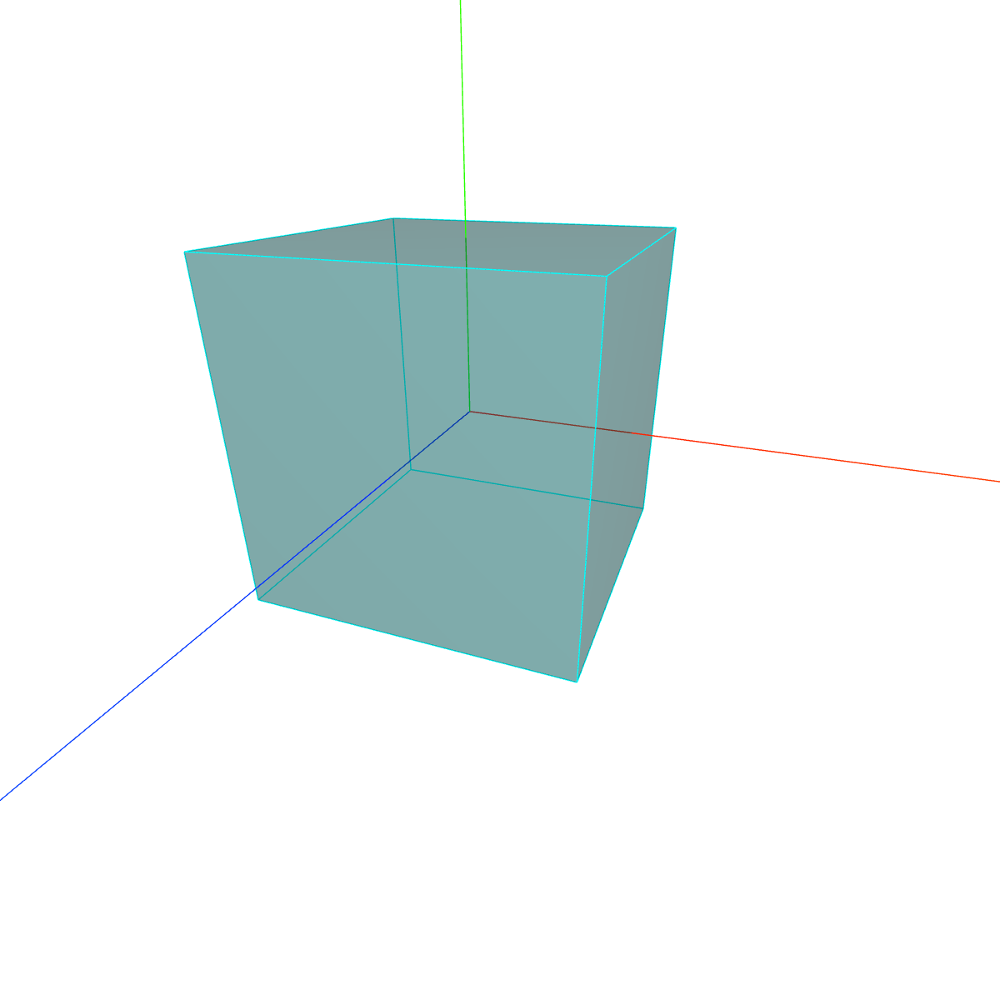
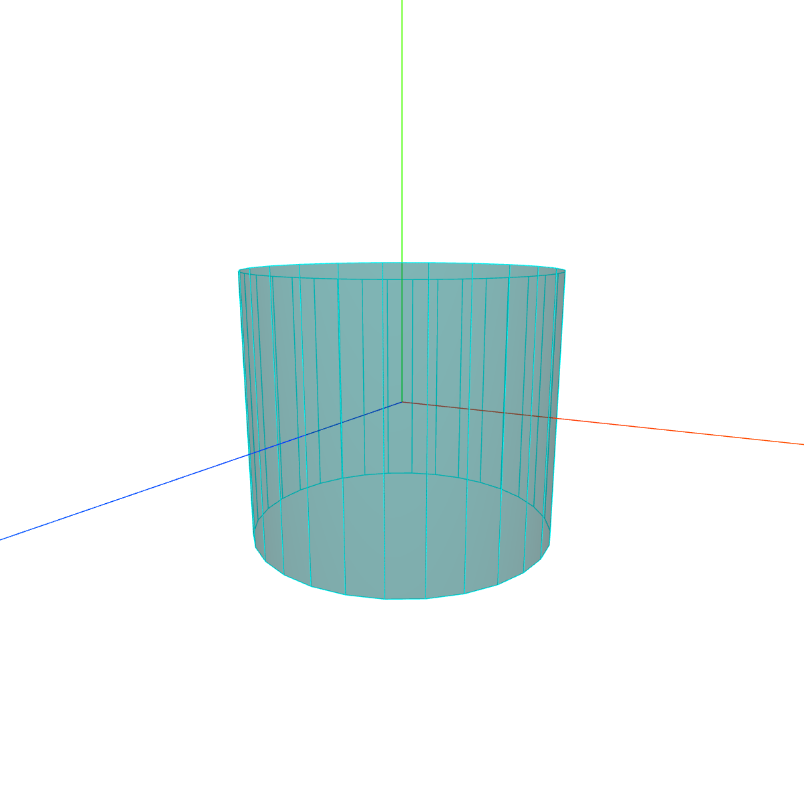
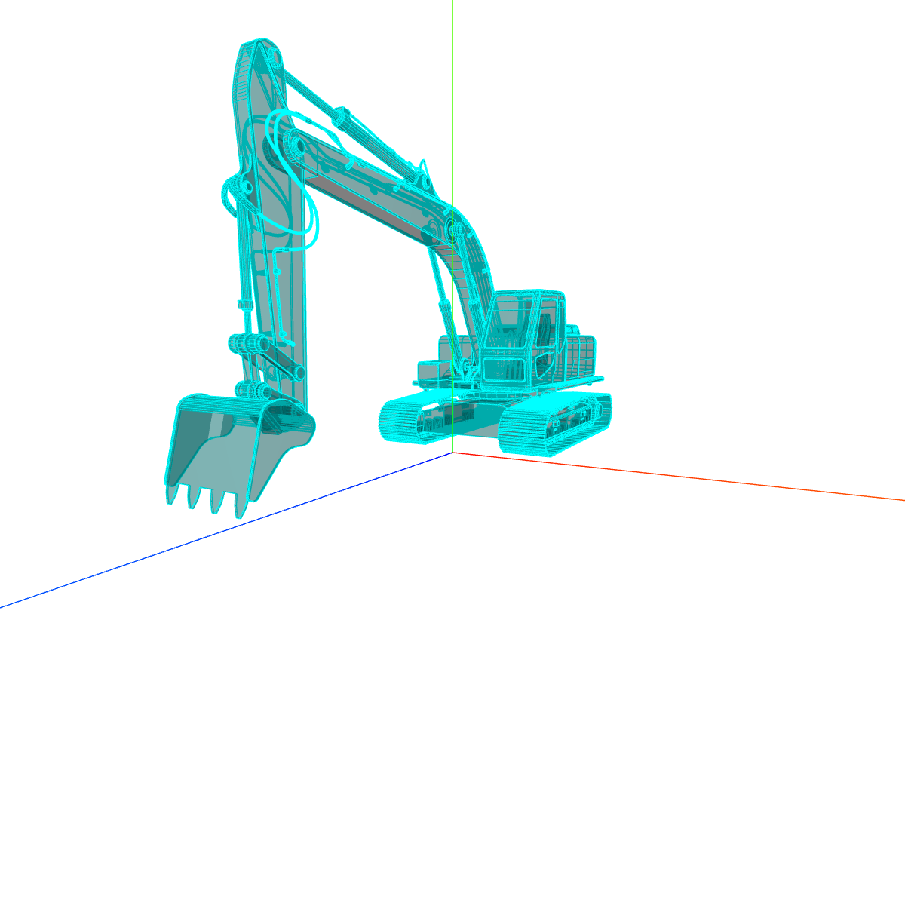

- 边界线模型

```tsx
class EdgesGeometry extends BufferGeometry {
    constructor( geometry = null, thresholdAngle = 1 ) {
        super();
    }
}
```

<table>
<tr>
<td style="width:600px;max-width:600px">

```tsx
const geometry = new THREE.BoxGeometry(50, 50, 50);
const material = new THREE.MeshLambertMaterial({
    color: 0x004444,
    transparent: true,
    opacity: 0.5,
});
const mesh = new THREE.Mesh(geometry, material);

// 长方体作为EdgesGeometry参数创建一个新的几何体
const edges = new THREE.EdgesGeometry(geometry);
const edgesMaterial = new THREE.LineBasicMaterial({
    color: 0x00ffff,
});
const line = new THREE.LineSegments(edges, edgesMaterial);
mesh.add(line);
scene.add(mesh);
```
</td>
<td style="min-width:260px"></td>
</tr>

<tr>
<td>

```tsx
const geometry = new THREE.CylinderGeometry(60, 60, 100, 30);
// ...
```
</td>
<td></td>
</tr>

<tr>
<td>

```tsx
const loader = new GLTFLoader();
const meshMaterial = new THREE.MeshLambertMaterial({
    color: 0x004444,
    transparent: true,
    opacity: 0.5,
});
const edgesMaterial = new THREE.LineBasicMaterial({
    color: 0x00ffff,
});
loader.load(
    '/api/static/markdown/front-end/three/model/工程车.gltf',
    (gltf) => {
        gltf.scene.traverse((obj) => {
            if (obj.isMesh) {
                // 模型材质重新设置
                obj.material = meshMaterial;
                // 模型边线设置
                const edges = new THREE.EdgesGeometry(obj.geometry);
                const line = new THREE.LineSegments(
                    edges,
                    edgesMaterial
                );
                obj.add(line);
            }
        });
        gltf.scene.scale.set(20, 20, 20);
        scene.add(gltf.scene);
    }
);
```
</td>
<td></td>
</tr>
</table>

