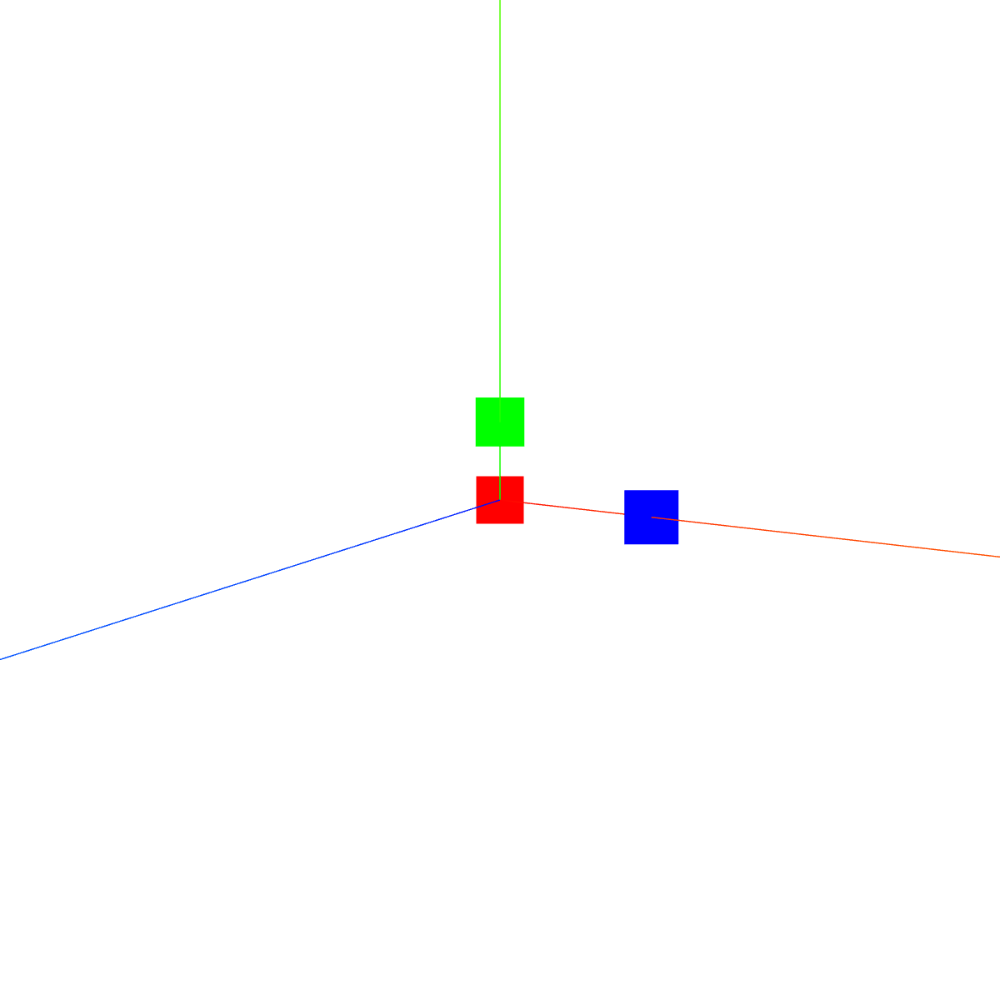
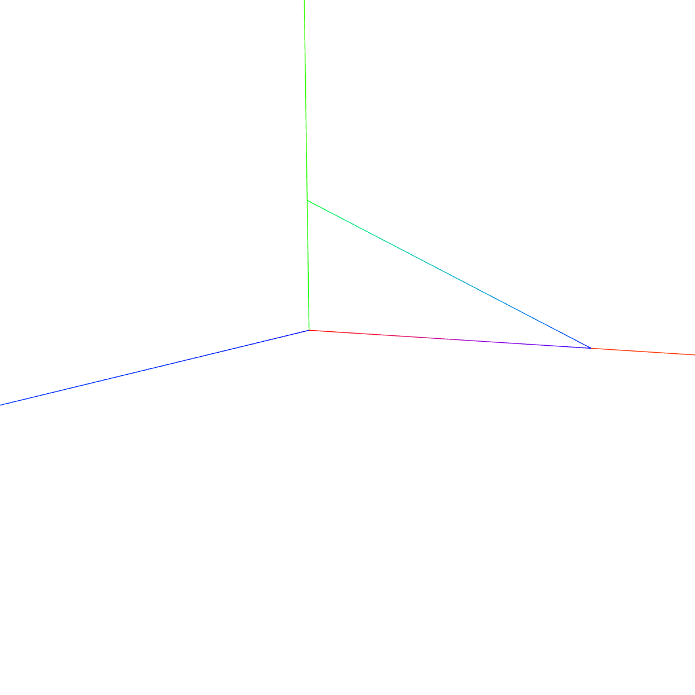
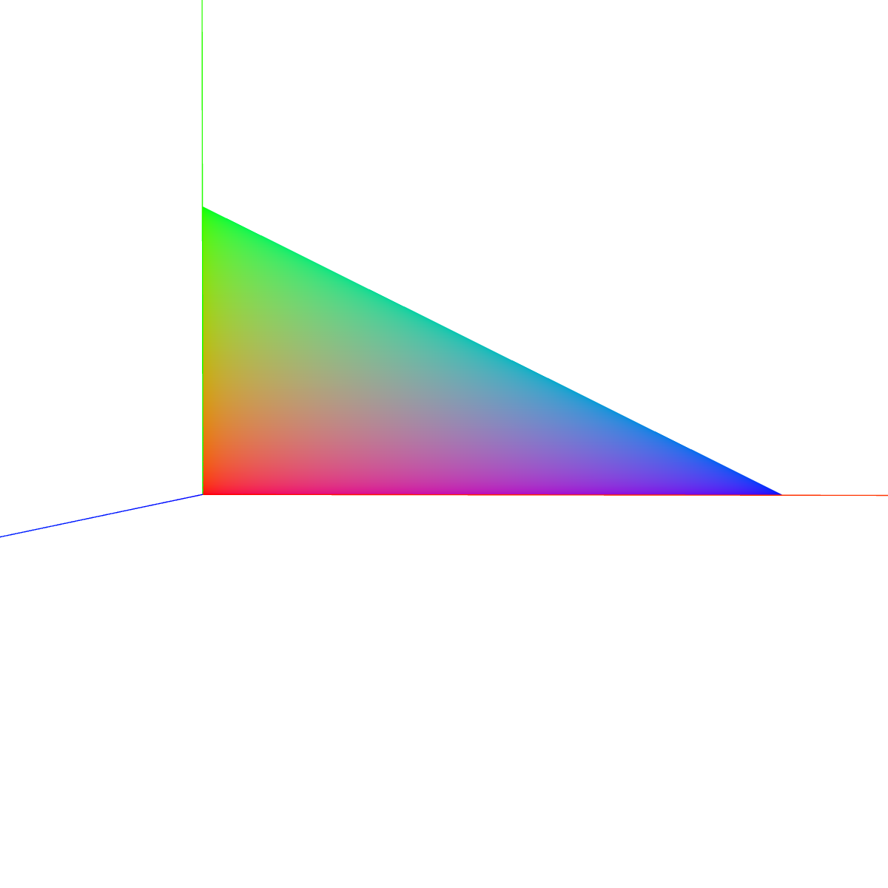
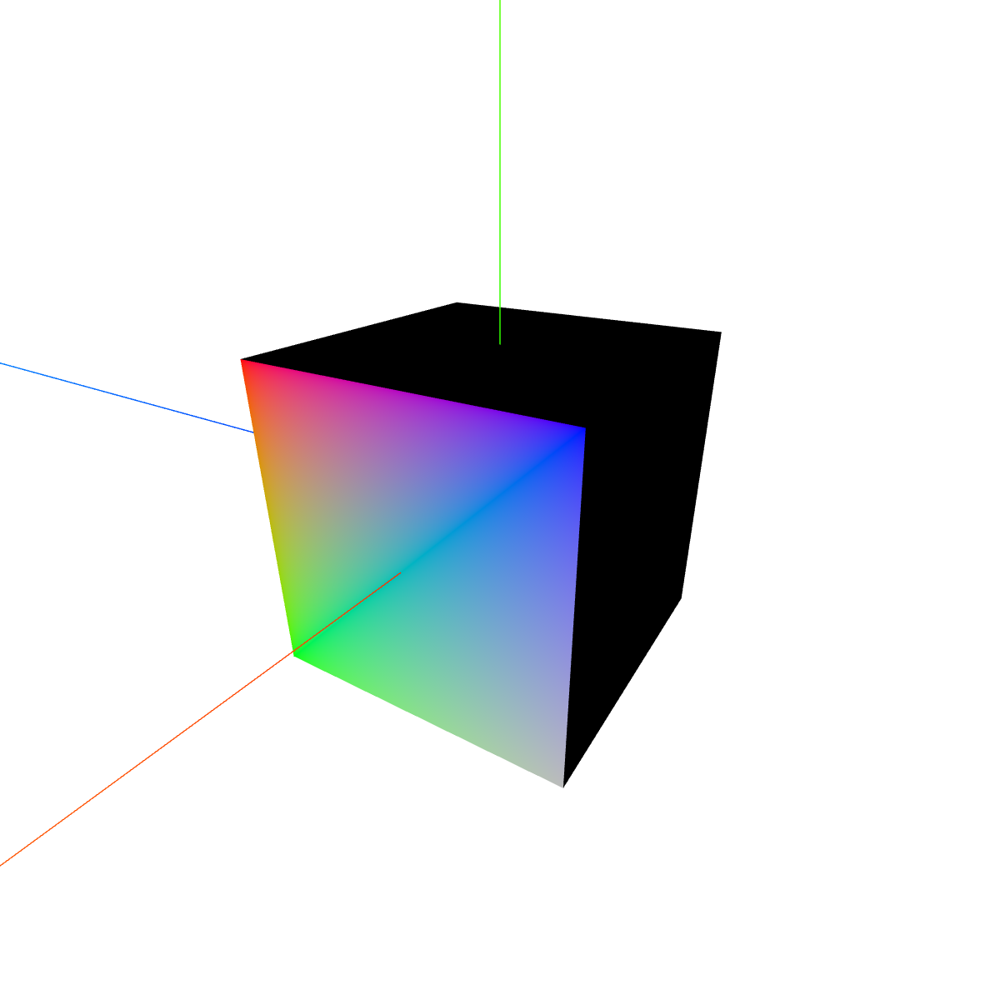

## 1. 顶点颜色
| `geometry`的`attributes` |     说明      |
| :----------------------: | :-----------: |
|        `position`        |   顶点坐标    |
|         `normal`         |    法向量     |
|           `uv`           | 贴图`map`范围 |
|         `color`          |   顶点颜色    |

:ballot_box_with_check: 点线面都可以渐变

<table>
<tr>
<td style="width:600px;max-width:600px">
 
```tsx
const geometry = new THREE.BufferGeometry(); //创建一个几何体对象
const vertices = new Float32Array([
    0, 0, 0, //顶点1坐标
    50, 0, 0, //顶点2坐标
    0, 25, 0, //顶点3坐标
]);
// 顶点位置
geometry.attributes.position = new THREE.BufferAttribute(vertices, 3);

const colors = new Float32Array([
    1, 0, 0, //顶点1颜色 
    0, 0, 1, //顶点2颜色
    0, 1, 0, //顶点3颜色
]);
// 设置几何体attributes属性的颜色color属性
//3个为一组,表示一个顶点的颜色数据RGB
geometry.attributes.color = new THREE.BufferAttribute(colors, 3);

// 点渲染模式
const material = new THREE.PointsMaterial({
    // color: 0x333333,//使用顶点颜色数据，color属性可以不用设置
    vertexColors: true, //默认false，设置为true表示使用顶点颜色渲染
    size: 20.0 //点对象像素尺寸
});
const points = new THREE.Points(geometry, material); //点模型对象
scene.add(points);
```
</td>
<td></td>
</tr>

<tr>
<td>

```tsx
// ...
const material = new THREE.LineBasicMaterial({
    vertexColors: true,
});
const line = new THREE.Line(geometry, material);
scene.add(line);
// 曲线同理，根据点生成样条曲线、贝塞尔曲线等，按一定division取出所有点，再设为bufferGeometry的position，再设置颜色数组，赋值，设置材质，添加
```
</td>
<td></td>
</tr>

<tr>
<td>

```tsx
// ...
const material = new THREE.MeshBasicMaterial({
    vertexColors: true, 
});
const mesh = new THREE.Mesh(geometry, material);
```
</td>
<td></td>
</tr>

<tr>
<td>

```tsx
const geometry = new THREE.BoxGeometry(100, 100, 100);
const colors = new Float32Array([
    1, 0, 0,
    0, 0, 1,
    0, 1, 0,
    0.5, 0.5, 0.5
]);
geometry.attributes.color = new THREE.BufferAttribute(colors, 3);
const material = new THREE.MeshBasicMaterial({
    vertexColors: true
});
const mesh = new THREE.Mesh(geometry, material);
scene.add(mesh);
```
</td>
<td></td>
</tr>
</table>


## 2. 颜色渐变插值
:ballot_box_with_check: `Color`实例的`lerpColors`和`lerp`方法；
:ballot_box_with_check: `Color`还有很多方法，见官网/源码；
```tsx
const c1 = new THREE.Color(0xff0000); //红色
const c2 = new THREE.Color(0x0000ff); //蓝色
const c = new THREE.Color(); // 空
c.lerpColors(c1,c2, 0); // c1*100%+c2*0%

c1.lerp(c2, percent); // 按百分比混合后赋给c1
```

