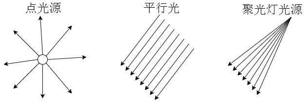

:ballot_box_with_check: `PointLight`、`SpotLight`、`DirectionalLight`可以产生阴影；


## 1. 平行光阴影配置

|         配置         |          说明           |
| :------------------: | :---------------------: |
|    `.castShadow`     |   产生阴影的模型对象    |
|    `.catsShadow`     |   产生阴影的光源对象    |
|   `.receiveShadow`   |     接收阴影的模型      |
| `.shadowMap.enabled` | WebGL渲染器允许阴影渲染 |
|   `.shadow.camera`   |  设置光源阴影渲染范围   |

- 例子

```tsx
// 设置产生投影的网格模型
mesh.castShadow = true;
// 平行光
const directionalLight = new THREE.DirectionalLight(0xffffff, 1);
// 光源默认不产生阴影，需要手动开启
directionalLight.castShadow = true;
// 设置渲染器，允许光源阴影渲染
renderer.shadowMap.enabled = true; 
// 查看平行光阴影相机属性（正投影相机），有正投影相机的参数和方法
// 如left、right、top、bottom、near、far、position等
console.log('阴影相机属性',directionalLight.shadow.camera);
```

## 2. 阴影贴图尺寸和阴影半径
|          配置          |                      说明                       |
| :--------------------: | :---------------------------------------------: |
| `light.shadow.mapSize` | 阴影贴图尺寸，把阴影看作贴图，用`.set(x,y)`设置 |
| `light.shadow.radius`  |                弱化模糊阴影边缘                 |
