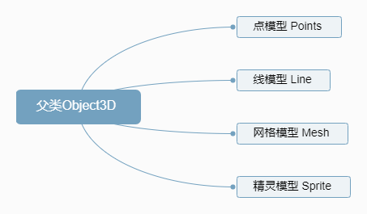
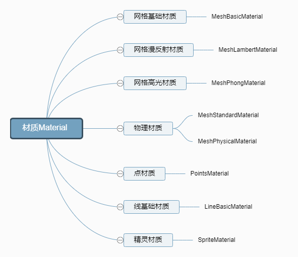
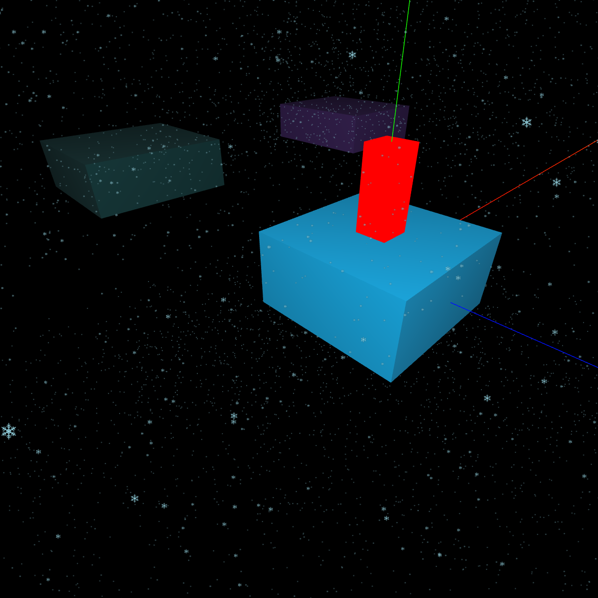

- 类的定义

```tsx
class Sprite extends Object3D {
    constructor( material = new SpriteMaterial() ) {
        super();
    }
}

class SpriteMaterial extends Material {
    constructor( parameters ) {
        super();
    }
}
```

```tsx
// 创建精灵模型对象，不需要几何体geometry参数
const sprite = new THREE.Sprite(spriteMaterial);
// 创建精灵材质对象SpriteMaterial
const spriteMaterial = new THREE.SpriteMaterial({
  color:0x00ffff,//设置颜色
});
```

:ballot_box_with_check: 精灵模型的属性有：
| `.position` | `.scale` | `rotation` |  ...  |
| :---------: | :------: | :--------: | :---: |

:ballot_box_with_check: 精灵材质的属性有：
| `.transparent` | `.opacity` | `map` | `color` | `fog  | `...  |
| :------------: | :--------: | :---: | :-----: | :---: | :---: |


- 通过贴图模拟下雨下雪效果，定点数量比其他几何体少，渲染性能提高

<table>
<tr>
<td>

```tsx
// ...
const group = new THREE.Group();
for (let i = 0; i < 16000; i++) {
    // 精灵模型共享材质
    const sprite = new THREE.Sprite(spriteMaterial);
    group.add(sprite);
    sprite.scale.set(1, 1, 1);
    // 设置精灵模型位置，在长方体空间上上随机分布
    const x = 1000 * (Math.random() - 0.5);
    const y = 600 * Math.random();
    const z = 1000 * (Math.random() - 0.5);
    sprite.position.set(x, y, z)
}
function loop() {
    // loop()每次执行都会更新雨滴的位置，进而产生动画效果
    group.children.forEach(sprite => {
        // 雨滴的y坐标每次减1
        sprite.position.y -= 1;
        if (sprite.position.y < -200) {
            // 如果雨滴落到地面，重置y，从新下落
            sprite.position.y = 200;
        }
    });
    requestAnimationFrame(loop);
}
loop();

```
</td>
<td></td>
</tr>

</table>

