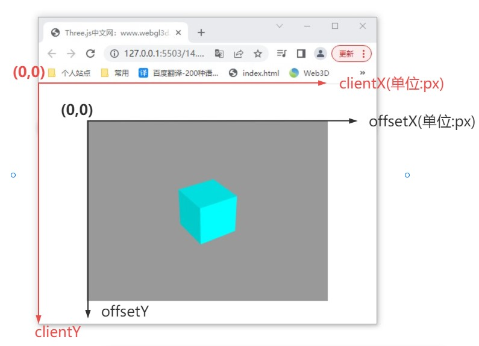
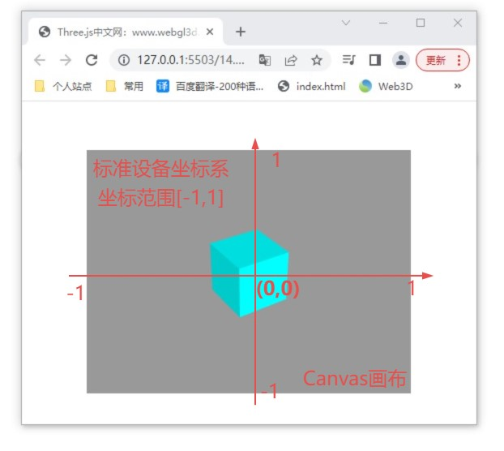

ps: 后处理`EffectComposer`没记，用的时候查官网查文档

## 1. 射线
```tsx
class Ray {
    // 起点、方向
    constructor( origin = new Vector3(), direction = new Vector3( 0, 0, - 1 ) ) {
        this.origin = origin;
        this.direction = direction;
    }
    set(origin,direction){}
    copy(ray){}
    at(t,target){}
    lookAt(v){}
    recast(t){}
    distanceToPoint(point){}
    intersectSphere(circle,target){}
    intersectPlane(plane,target){}
    intersectBox(box,target){}
    intersectTriangle(a,b,c,backfaceCulling,target){} // 和三角形是否相交，abc是三角形顶点坐标，backfaceCulling是否进行背面剔除；返回交点坐标或null
    equals(ray){}
    clone(){}
    // ...
}
```

## 2. 射线拾取模型
- `Raycaster`

:ballot_box_with_check: 用`intersectObjects()`方法，传入单个模型或多个模型的数组（`Mesh`、`Line`、`Sprite`...），返回与射线相交的模型数组或`[]`；

```tsx
// 射线拾取器模型
const raycaster = new THREE.Raycaster();
// 设置射线起点和方向
raycaster.ray.origin = new THREE.Vector3(-100, 0, 0);
raycaster.ray.direction = new THREE.Vector3(1, 0, 0);
// 注意更新下模型的世界矩阵，你设置的mesh.position生效，再进行射线拾取计算
model.updateMatrixWorld(true);
// 射线发射拾取模型对象
const intersects = raycaster.intersectObjects([mesh1, mesh2, mesh3]);
console.log("射线器返回的对象", intersects); // 返回数组
if (intersects.length > 0) {
    // 若有，每个元素都有point、object、distance
    console.log("交叉点坐标", intersects[0].point);
    console.log("交叉对象",intersects[0].object);
    console.log("射线原点和交叉点距离",intersects[0].distance);
}
```

## 3. 屏幕坐标转标准设备坐标

<table>
<tr align="center">
<td></td>
<td> => </td>
<td style="min-width:260px"></td>
</tr>

<tr>
<td>

```tsx
// 坐标转化公式
addEventListener('click',function(event){
    const px = event.offsetX;
    const py = event.offsetY;
    //屏幕坐标px、py转标准设备坐标x、y
    //width、height表示canvas画布宽高度
    const x = (px / width) * 2 - 1;
    // const x = (px - width/2)/(width/2)
    const y = -(py / height) * 2 + 1;
})
```
</td>
<td>

```tsx
// 屏幕坐标转标准设备坐标
addEventListener('click',function(event){
    // left、top表示canvas画布布局，距离顶部和左侧的距离(px)
    const px = event.clientX-left;
    const py = event.clientY-top;
    //屏幕坐标px、py转标准设备坐标x、y
    //width、height表示canvas画布宽高度
    const x = (px / width) * 2 - 1;
    const y = -(py / height) * 2 + 1;
})
```
</td>
</tr>
</table>

## 4. 鼠标选中模型
:ballot_box_with_check: 思路：找到和射线相交的模型，修改；
:ballot_box_with_check: 如果画布大小变了，记得这里更新；

```tsx
renderer.domElement.addEventListener('click', function (event) {
    // .offsetY、.offsetX以canvas画布左上角为坐标原点,单位px
    const px = event.offsetX;
    const py = event.offsetY;
    //屏幕坐标px、py转WebGL标准设备坐标x、y
    //width、height表示canvas画布宽高度
    const x = (px / width) * 2 - 1;
    const y = -(py / height) * 2 + 1;
    //创建一个射线投射器`Raycaster`
    const raycaster = new THREE.Raycaster();
    //.setFromCamera()计算射线投射器`Raycaster`的射线属性.ray
    // 形象点说就是在点击位置创建一条射线，指向相机位置，射线穿过的模型代表选中
    raycaster.setFromCamera(new THREE.Vector2(x, y), camera);
    //.intersectObjects([mesh1, mesh2, mesh3])对参数中的网格模型对象进行射线交叉计算
    // 未选中对象返回空数组[],选中一个对象，数组1个元素，选中两个对象，数组两个元素
    const intersects = raycaster.intersectObjects([mesh1, mesh2, mesh3]);
    console.log("射线器返回的对象", intersects);
    // intersects.length大于0说明，说明选中了模型
    if (intersects.length > 0) {
        // 选中模型的第一个模型，设置为红色
        intersects[0].object.material.color.set(0xff0000);
    }
})
```

## 5. 含多个层级的射线拾取模型
- 问题： 需要提取父对象，但提取出来的都是子对象；

:ballot_box_with_check: 给需要射线拾取的父对象的所有子对象`Mesh`自定义属性`.ancestors`，指向需要射线拾取的父对象，提取的时候根据这个属性找出来；

```tsx
addEventListener('click', function (event) {
    const px = event.offsetX;
    const py = event.offsetY;
    //屏幕坐标转标准设备坐标
    const x = (px / window.innerWidth) * 2 - 1;
    const y = -(py / window.innerHeight) * 2 + 1;
    const raycaster = new THREE.Raycaster();
    //.setFromCamera()在点击位置生成raycaster的射线ray
    raycaster.setFromCamera(new THREE.Vector2(x, y), camera);
    const cunchu = model.getObjectByName('存储罐');
    // 射线拾取模型对象(包含多个Mesh)
    // 可以给待选对象的所有子孙后代Mesh，设置一个祖先属性ancestors,值指向祖先(待选对象)    
    for (let i = 0; i < cunchu.children.length; i++) {
        const group = cunchu.children[i];
        //递归遍历chooseObj，并给chooseObj的所有子孙后代设置一个ancestors属性指向自己
        group.traverse(function (obj) {
            if (obj.isMesh) {
                obj.ancestors = group;
            }
        })
    }
    // 射线交叉计算拾取模型
    const intersects = raycaster.intersectObjects(cunchu.children);
    console.log('intersects', intersects);
    if (intersects.length > 0) {
        // 通过.ancestors属性判断那个模型对象被选中了
        outlinePass.selectedObjects = [intersects[0].object.ancestors];
    }
})
```

