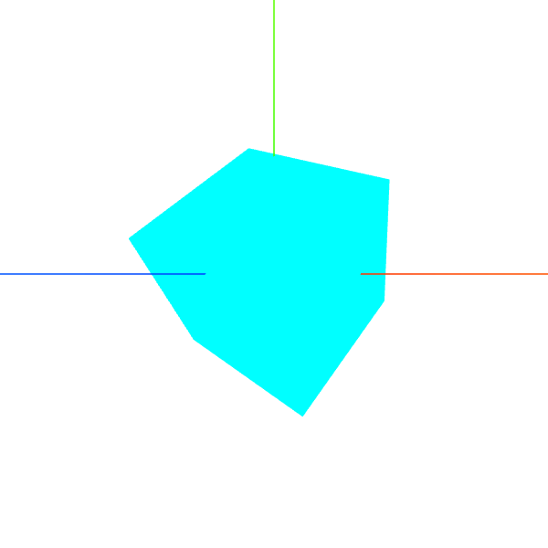
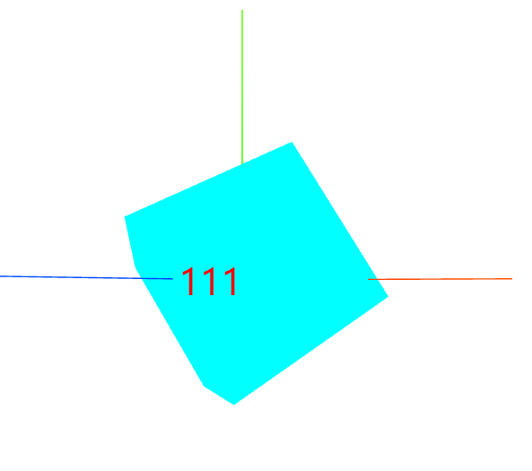

## 1. CSS2DObject和CSS2DRenderer
:ballot_box_with_check: `CSS2DRenderer`，把HTML元素作为标签标注到三维场景；
:white_check_mark: 传入一个DOM元素，生成`Object3D`的实例，具有它的属性、方法；

<table>
<tr>
<td>

```tsx
class CSS2DObject extends Object3D {
    constructor( element = document.createElement( 'div' ) ) {
        super();
        this.isCSS2DObject = true;
        this.element = element;
        this.element.style.position = 'absolute';
        this.element.style.userSelect = 'none';
        this.element.setAttribute( 'draggable', false );
        this.center = new Vector2( 0.5, 0.5 ); // ( 0, 0 ) is the lower left; ( 1, 1 ) is the top right
    }
}

class CSS2DRenderer {
    constructor( parameters = {} ) {
        // ...
    }
    // 和WebGLRenderer()类似，
    // 有render()、setSize()、domElement等
}
```
</td>
</tr>
</table>

:white_check_mark: `css2Renderer.domElement.style.pointerEvents = 'none';`，<span style="color:red;font-size:26px"><b>解决HTML元素标签对画布鼠标事件的遮挡</b></span>；
:white_check_mark: CSS样式`z-index`设置标签和模型的重叠关系，谁覆盖谁；
<table>
<tr>
<td style="width:600px;max-width:600px;">

```tsx
// ...
import { CSS2DRenderer, CSS2DObject } from 'three/addons/renderers/CSS2DRenderer.js';

// setup中
const container = ref<HTMLDivElement>();
const testDiv = ref<HTMLDivElement>();
const scene = new THREE.Scene();
const camera = new THREE.PerspectiveCamera(75, 1.0, 0.1, 10000);
camera.position.set(200, 200, 200);
const renderer = new THREE.WebGLRenderer({
    alpha: true,
    antialias: true
});
renderer.setSize(600, 600);

const geometry = new THREE.BoxGeometry(100, 100, 100);
const material = new THREE.MeshBasicMaterial({ color: 'cyan' });
const mesh = new THREE.Mesh(geometry, material);
scene.add(mesh);

function createCss2DObject() {
    const containerTag = new CSS2DObject(testDiv.value!);
    containerTag.position.set(-300, 0, 0);
    scene.add(containerTag);
}
const css2Renderer = new CSS2DRenderer();
css2Renderer.setSize(600, 600);
css2Renderer.domElement.style.pointerEvents = 'none';
css2Renderer.render(scene, camera);
const css2DObjectStyle = {
    width: '100px',
    height: '100px',
    fontSize: '40px',
    color: 'red',
    textAlign: 'center',
    lineHeight: '100px',
    zIndex: -10
};

scene.add(new THREE.AxesHelper(1000));

new OrbitControls(camera, renderer.domElement);
function animate() {
    requestAnimationFrame(animate);
    css2Renderer.render(scene, camera);
    mesh.rotation.x += 0.01;
    mesh.rotation.y += 0.01;
    mesh.rotation.z += 0.01;
    renderer.render(scene, camera);
}
animate();

onMounted(() => {
    createCss2DObject();
    container.value!.appendChild(css2Renderer.domElement);
    Object.entries(css2DObjectStyle).map(([key, value]) => {
        css2Renderer.domElement.style[key] = value;
    });
    container.value!.appendChild(renderer.domElement);
    renderer.domElement.style.zIndex=10;
    container.value!.ondblclick = () => {
        if (document.fullscreenElement) {
            document.exitFullscreen();
        } else {
            container.value!.requestFullscreen();
        }
    };
});

return () => (
    <>
        <div ref={testDiv}>
            <span>111</span>
        </div>
        <div ref={container} class='jump-container'></div>
    </>
);
```
</td>
<td>


```tsx
css2DObjectStyle.zIndex = 100; // 之后
// 不属于canvas，而是在container中，和canvas标签并列，需要手动截图
// 或者整体转为canvas再保存
```

</td>
</tr>
</table>

:white_check_mark:  也可以吧`CSS2DObject`的实例直接加到比如`mesh`的`children`中；
:white_check_mark: 加载模型，找到子对象，添加标注...，点击显示标注；


## 2. CSS3DObject和CSS3DRenderer

|      `CSS2DRenderer`       | `CSS3DRenderer` |
| :------------------------: | :-------------: |
| 标签会跟着场景相机同步缩放 | 保持自身像素值  |

```tsx
import { CSS3DObject } from 'three/addons/renderers/CSS3DRenderer.js';
import {CSS3DRenderer} from 'three/addons/renderers/CSS3DRenderer.js';
// 其他操作和2的一样
```

## 3. CSS3DSprite精灵模型

- 特点：跟着场景缩放、旋转，但自身的姿态角度始终平行于`canvas`

```tsx
import { CSS3DSprite } from 'three/addons/renderers/CSS3DRenderer.js';

const div = document.getElementById('tag');
const tag = new CSS3DSprite(div);
mesh.add(tag);
```


## 4. canvas作为纹理(map)

```tsx
new THREE.CanvasTexture(canvasDom);
```