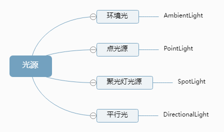
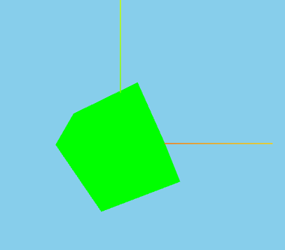
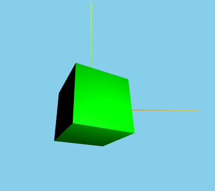
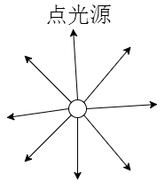
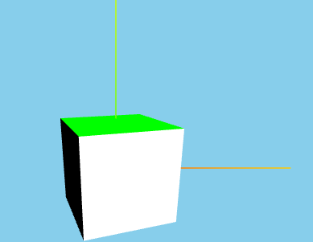
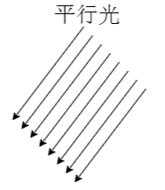
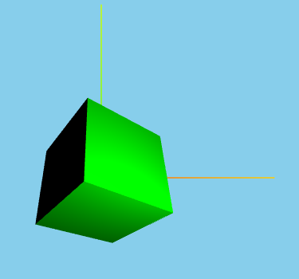
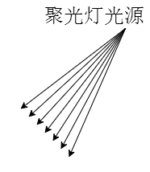
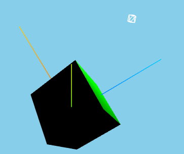

## 1. 分类



1. 所有光必传参数：颜色(`color`)、强度(`intensity`)
2. 方法有： `get power()`、`set power(value)`，获取/设置能量，与`intensity`同步，即$power = 4*\pi*intensity$等
   :ballot_box_with_check: 聚光灯光源和平行光还有`target`属性，默认值`new THREE.Object3D()`；

## 2. 类的定义

<table>
<tr>
<td>

```tsx
class AmbientLight extends Light {
    constructor(color, intensity) {
        super(color, intensity);
        // ...
    }
}
```

</td>
<td rowspan="4">

```tsx
class Light extends Object3D {
    constructor(color, intensity = 1) {
        super();
        // ...
    }
}
```

</td>
</tr>

<tr>
<td>

```tsx
class PointLight extends Material {
    constructor(color, intensity, distance = 0, decay = 2) {
        super(color, intensity);
        // ...
    }
}
```

</td>
</tr>

<tr>
<td>

```tsx
class SpotLight extends Light {
    // angle是发散角度
    constructor(color, intensity, distance = 0, angle = Math.PI / 3, penumbra = 0, decay = 2) {
        super(color, intensity);
        // ...
    }
}
```

</td>
</tr>

<tr>
<td>

```tsx
class DirectionalLight extends Light {
    constructor(color, intensity) {
        super(color, intensity);
        // ...
    }
}
```

</td>
</tr>
</table>

## 3. 例子

<table>

<tr align="center">
   <td>分类</td>
   <td style="min-width:160px">效果</td>
   <td>代码</td>
   <td style="min-width:160px">说明</td>
</tr>

<tr align="center">
   <td>AmbientLight环境光</td>
   <td></td>
   <td>

```tsx
const ambientLight = new THREE.AmbientLight(0xffffff, 100000);
scene.add(ambientLight);
```

   </td>
    <td>整个环境的光</td>
</tr>

<tr align="center">
<td><code>PointLight</code>点光源</td>
<td></td>
<td>

```tsx
const pointLight = new THREE.PointLight(0xffffff, 100000);
// decay = xxx;改衰减，默认是2,0表示不衰减
// 其他参数distance、decay
scene.add(pointLight);
```

</td>
<td></td>
</tr>

<tr align="center">
<td><code>DirectionalLight</code>平行光</td>
<td></td>
<td>

```tsx
const directionalLight = new THREE.DirectionalLight(0xffffff, 1);
directionalLight.position.set(100, 0, 200);
// 平行光指向对象网格模型mesh，可以不设置，默认的位置是0,0,0
// 直接设置target或target.set(x,y,z)
directionalLight.target = mesh;
scene.add(directionalLight);
```

</td>
<td></td>
</tr>

<tr align="center">
<td><code>SpotLight</code>聚光灯光源</td>
<td></td>
<td>

```tsx
const spotLight = new THREE.SpotLight(0xffffff, 100000);
scene.add(spotLight);
// 其他参数：distance、angle、penumbra、decay
// target后面改
```

</td>
<td></td>
</tr>
</table>

## 4. 点光源可视化

<table>
<tr>
<td  style="width:600px;max-width:600px;">

```tsx
const pointLightHelper = new THREE.PointLightHelper(pointLight, 10);
// 参数有light、sphereSize、color(不传则白色)
pointLightHelper.position.set(0, 0, 500);
scene.add(pointLightHelper);
```

</td>
<td style="min-width:160px">

</td>
</tr>
</table>

-   类的定义
<table>
<tr>
<td>

```tsx
class PointLightHelper extends Mesh {
    constructor(light, sphereSize, color) {
        const geometry = new SphereGeometry(sphereSize, 4, 2);
        const material = new MeshBasicMaterial({ wireframe: true, fog: false, toneMapped: false });
        super(geometry, material);
        // ...
    }
}
```

</td>
<td>

```tsx
class Mesh extends Object3D {
    constructor(geometry = new BufferGeometry(), material = new MeshBasicMaterial()) {
        super();
        // ...
    }
}
```

</td>
</tr>
</table>

## 5. 聚光灯光源可视化

```tsx
class SpotLightHelper extends Object3D {
    constructor(light, color);
    super();
}
```

## 6. 平行光光源可视化

```tsx
class DirectionalLightHelper extends Object3D {
    constructor(light, size, color) {
        super();
    }
}
```

:warning: 如果发现光照没显示，检查位置、强度、所选材质等；
