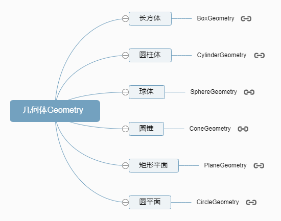
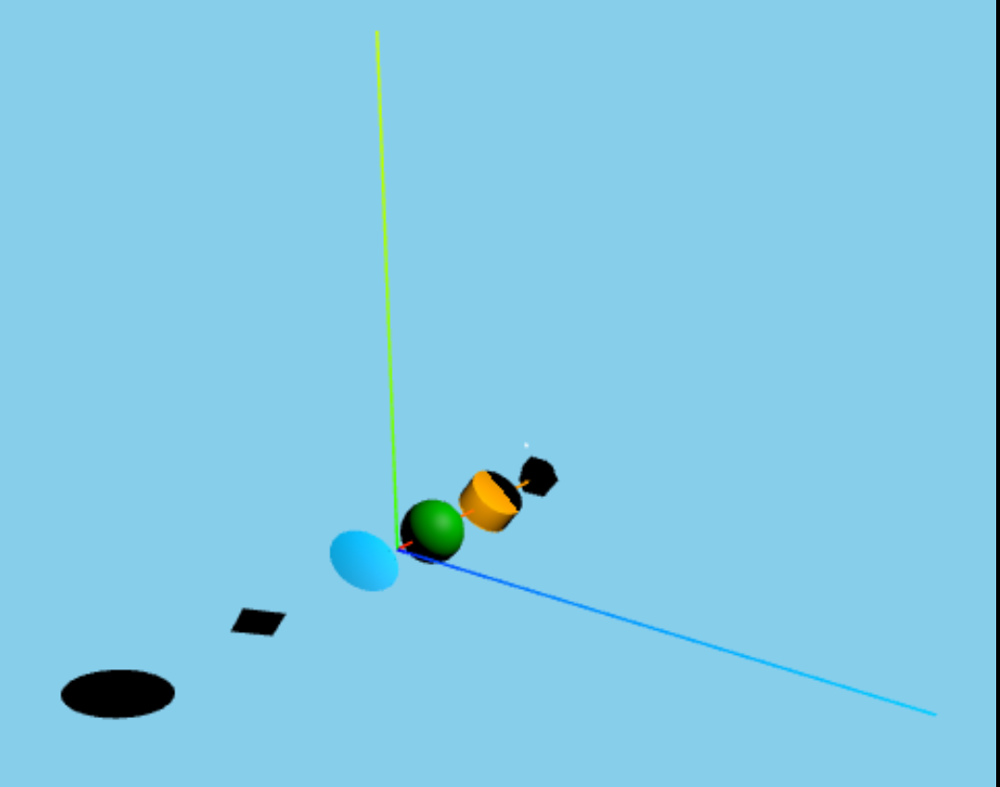

## 1. 分类


## 2. 类的定义
<table>
<tr>
<td></td>
<td>

```tsx
class BoxGeometry extends BufferGeometry {
    constructor( width = 1, height = 1, depth = 1, widthSegments = 1, heightSegments = 1, depthSegments = 1 ) {
        super();
        // ...
    }
}
```
</td>
<td rowspan="6">

```tsx
class BufferGeometry extends EventDispatcher {
    constructor() {
        super();
        // ...
    }
}
```
</td>
</tr>

<tr>
<td></td>
<td>

```tsx
class SphereGeometry extends BufferGeometry {
    constructor( radius = 1, widthSegments = 32, heightSegments = 16, phiStart = 0, phiLength = Math.PI * 2, thetaStart = 0, thetaLength = Math.PI ) {
        super();
        // ...
      }
}
```
</td>
</tr>

<tr>
<td>

```tsx
class ConeGeometry extends CylinderGeometry {
    constructor( radius = 1, height = 1, radialSegments = 32, heightSegments = 1, openEnded = false, thetaStart = 0, thetaLength = Math.PI * 2 ) {
        super( 0, radius, height, radialSegments, heightSegments, openEnded, thetaStart, thetaLength );
        // ...
      }
}
```
</td>
<td>

```tsx
class CylinderGeometry extends BufferGeometry {
    constructor( radiusTop = 1, radiusBottom = 1, height = 1, radialSegments = 32, heightSegments = 1, openEnded = false, thetaStart = 0, thetaLength = Math.PI * 2 ) {
        super();
        // ...
      }
}
```
</td>
</tr>

<tr>
<td></td>
<td>

```tsx
class PlaneGeometry extends BufferGeometry {
    constructor( width = 1, height = 1, widthSegments = 1, heightSegments = 1 ) {
        super();
        // ...
      }
}
```
</td>
</tr>

<tr>
<td></td>
<td>

```tsx
class CircleGeometry extends BufferGeometry {
    constructor(  radius = 1, segments = 32, thetaStart = 0, thetaLength = Math.PI * 2 ) {
        super();
        // ...
      }
}
```
</td>
</tr>

<tr>
<td></td>
<td>

```tsx
class RingGeometry extends BufferGeometry {
    constructor( innerRadius = 0.5, outerRadius = 1, thetaSegments = 32, phiSegments = 1, thetaStart = 0, thetaLength = Math.PI * 2 )  {
        super();
        // ...
      }
}
```
</td>
</tr>
</table>

:white_check_mark: `xxxsegments`表示某个属性的细分数，越大越细，表面越光滑，但渲染越慢；
:white_check_mark: 不影响渲染效果情况下越少越好；

## 3. 例子
```tsx
const createMesh = (type: string, color: string, index: number) => {
    const geometry = new THREE[type](300, 300, 300);
    const material = new THREE.MeshPhongMaterial({ color });
    const mesh = new THREE.Mesh(geometry, material);
    mesh.position.set(-1000 * index + 2500, 0, 0);
    return mesh
};

const geometryAttrArr = [
    {
        type: 'BoxGeometry',
        color: 'red'
    },
    {
        type: 'CylinderGeometry',
        color: 'orange'
    },
    {
        type: 'SphereGeometry',
        color: 'green'
    },
    {
        type: 'ConeGeometry',
        color: 'deepskyblue'
    },
    {
        type: 'PlaneGeometry',
        color: 'purple'
    },
    {
        type: 'CircleGeometry',
        color: 'black'
    }
]
let meshList: any = [];
interface geometryType {
    type: string,
    color: string
};
geometryAttrArr.forEach((item: geometryType, index: number) => {
    meshList.push(createMesh(item.type, item.color, index))
})
meshList.forEach(mesh => scene.add(mesh))
```



