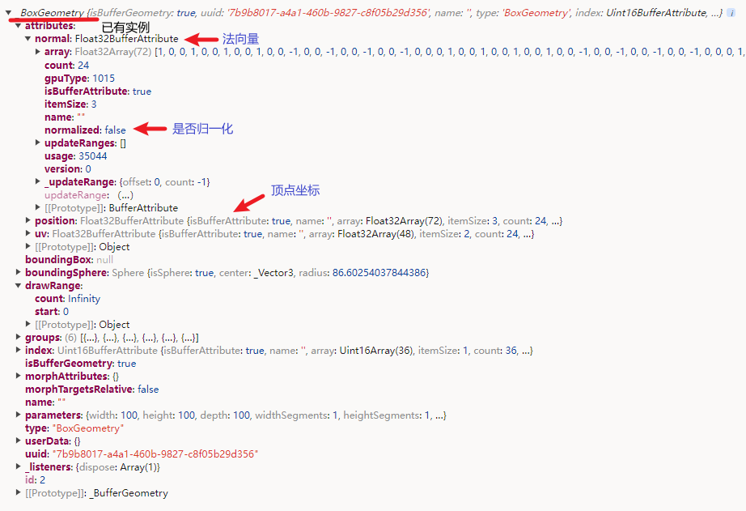
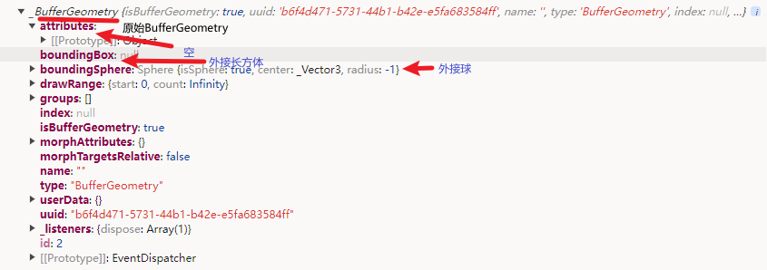
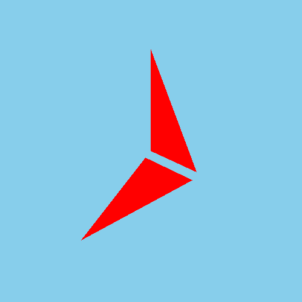
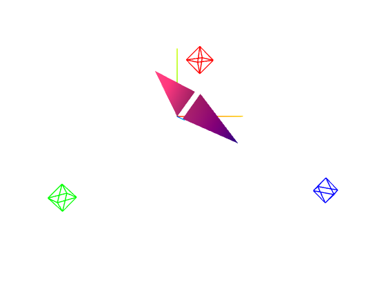

> 缓冲类型几何体，没有任何形状的空几何体，通过加点**自定义**形状
> 是`BoxGeometry`、`SphereGeometry`等的父类

## 1. 类的定义

<table>
<tr>
<td>

```tsx
class BufferGeometry extends EventDispatcher {
    constructor() {
        super();
        // ...
    }
}
```

</td>
</tr>

<tr>
<td>

```tsx
class BufferAttribute {
    constructor(array, itemSize, normalized = false) {
        // ...
    }
}
```

</td>
</tr>
</table>

## 2. 汇总

<table>
<tr align="center">
<td>子类</td>
<td>子类中的属性、方法</td>
<td>父类</td>
<td>父类中的共有属性方法</td>
</tr>

<tr align="center">
<td>

`BoxGeometry`长方体

</td>

<td>

`type`<br/>
`parameters`（构造函数中传来的参数：`width`、`height`、`depth`、`widthSegments`、`heightSegments`、`depthSegments`）

</td>
<td rowspan="6">

`BufferGeometry`

</td>

<td rowspan="6">

`isBufferGeometry`、`uuid`、`name`、`type`、`index`、`attributes`、`groups`、`boundingBox`、`boundingSphere`<br/>
`getIndex()`、`setIndex(index)`、`getAttribute(name)`、`setAttribute(name,attribute)`、`deleteAttribute(name)`、`hasAttribute(name)`<br/>
`addGroup(start,count,materialIndex=0)`、`clearGroups()`、`rotateX(angle)`、`rotateY(angle)`、`rotateZ(angle)`<br/>
`translate(x,y,z)`、`scale(x,y,z)`、`lookAt(vector)`、`center()`、`setFromPoints(points)`、`computeBoundingBox()`、`computeBoundingSphere()`<br>
`normalizeNormals()`、`toJSON()`、`clone()`、`copy(source)`、`dispose()`

</td>
</tr>

<tr align="center">
<td>

`CylinderGeometry`圆柱/台
</td>

<td>

`type`
<br/>
`parameters`（构造函数中传来的参数：`radiusTop`、`radiusBottom`、`height`、`radialSegments`、`heightSegments`、`openEnded`、`thetaStart`、`thetaLength`）<br/>
`copy(source)`

</td>
</tr>

<tr align="center">
<td>

`SphereGeometry`球
</td>

<td>

`type`
<br/>
`parameters`（构造函数中传来的参数：`radius`、`widthSegments`、`heightSegments`、`phiStart`、`phiLength`、`thetaStart`、`thetaLength`）<br/>
`copy(source)`

</td>
</tr>

<tr align="center">
<td>

`ConeGeometry`圆锥
</td>

<td>

`type`
<br/>
`parameters`（构造函数中传来的参数：`radius`、`height`、`radialSegments`、`heightSegments`、`openEnded`、`thetaStart`、`thetaLength`）

</td>
</tr>

<tr align="center">
<td>

`PlaneGeometry`长方形
</td>

<td>

`type`
<br/>
`parameters`（构造函数中传来的参数：`width`、`height`、`widthSegments`、`heightSegments`）<br/>
`copy(source)`

</td>
</tr>
<!-- 
<!-- <tr align="center">
<td>

`CircleGeometry`圆
</td>

<td>

`type`
<br/>
`parameters`（构造函数中传来的参数：`radius`、`segments`、`thetaStart`、`thetaLength`）<br/>
`copy(source)`

</td>
</tr> --> -->

<tr align="center">
<td>

`RingGeometry`圆环
</td>

<td>

`type`
<br/>
`parameters`（构造函数中传来的参数：`innerRadius`、`outerRadius`、`thetaSegments`、`phiSegments`、`thetaStart`、`thetaLength`）<br/>
`copy(source)`

</td>
</tr>
</table>

......

## 3. 创建的`BufferGeometry`对象的重要属性

|     属性     |              获取              |          设置（都要用`new THREE.BufferAttribute()`传入类型化数组来创建）          |                                                          说明                                                          |
| :----------: | :----------------------------: | :-------------------------------------------------------------------------------: | :--------------------------------------------------------------------------------------------------------------------: |
|     顶点     | `geometry.attributes.position` | `geometry.attributes.position = xxx`<br/>`geometry.setAttribute('position', xxx)` |                                                       类型化数组                                                       |
|     法线     |  `geometry.attributes.normal`  |   `geometry.attributes.normal = xxx`<br/>`geometry.setAttribute('normal', xxx)`   | 类型化数组<br/>受光照影响的材质，几何体要有**顶点法线**数据；<br/>具体模型已经创建好了，而`BufferGeometry`需要自己创建 |
| 顶点 UV 坐标 |    `geometry.attributes.uv`    |                           `geometry.attributes.uv=xxx`                            |                                              把贴图的哪部分映射到物体表面                                              |

:white_check_mark:
<br/>
:one: `BufferGeometry`是个空壳，要从头建起，里面的顶点坐标和、法向量和 UV 坐标要通过`BufferAttribute()`传入类型化数组生成；
<br/>
:two: 其他继承它的物体都有默认的一些形状、大小等；

<table>
<tr>
<td>

`Geometry`

</td>
<td></td>
</tr>

<tr>
<td>

`BufferGeometry`

</td>
<td></td>
</tr>
</table>

## 3. 顶点数据例子

```tsx
setup() {
    const scene = new THREE.Scene();
    scene.background = new THREE.Color('skyblue');
    const camera = new THREE.PerspectiveCamera( 75, 1.0, 0.1, 1000 );
    camera.position.set(0, 0, 200);

    const geometry = new THREE.BufferGeometry();
    const vertices = new Float32Array([
        0, 0, 0,
        50, 0, 0,
        0, 100, 0,
        0, 0, 10,
        0, 0, 100,
        50, 0, 10
    ]);
    const attribute = new THREE.BufferAttribute(vertices, 3);
    geometry.attributes.position = attribute;
    // geometry.setAttribute('position', attribute);

    const material = new THREE.MeshBasicMaterial({ color: 'red' });
    const mesh = new THREE.Mesh(geometry, material);
    mesh.position.set(0, 0, 0);
    scene.add(mesh);

    const renderer = new THREE.WebGLRenderer({ alpha: true });
    renderer.setSize(500, 500);

    function animate() {
        requestAnimationFrame(animate);
        renderer.render(scene, camera);
    };
    animate();

    new OrbitControls(camera, renderer.domElement);

    const container = ref<HTMLDivElement>();

    onMounted(() => {
        container.value!.appendChild(renderer.domElement);
    });

    return () => (
        <div ref={container} class="container"></div>
    )
}
```



## 4. 法线数据例子

```tsx
setup(props, ctx) {
    const scene = new THREE.Scene();
    // scene.background = 'blue';
    const camera = new THREE.PerspectiveCamera(75, 1.0, 0.1, 1000);
    camera.position.set(0, 0, 400);
    camera.lookAt(0, 0, 0);

    // const geometry = new THREE.BoxGeometry(100, 100, 100);
    const geometry = new THREE.BufferGeometry();
    const vertices = new Float32Array([
        0, 0, 0,
        50, 0, 0,
        0, 100, 0,
        0, 0, 10,
        0, 0, 100,
        50, 0, 10
    ]);
    const normals = new Float32Array([
        0, 0, 1, //顶点1法线( 法向量 )
        0, 0, 1, //顶点2法线
        0, 0, 1, //顶点3法线
        0, 0, 1, //顶点4法线
        0, 0, 1, //顶点5法线
        0, 0, 1, //顶点6法线
    ]);

    geometry.setAttribute('position', new THREE.BufferAttribute(vertices, 3));
    // geometry.attributes.position = new THREE.BufferAttribute(vertices, 3);
    geometry.setAttribute('normal', new THREE.BufferAttribute(normals, 3));
    // geometry.attributes.normal = new THREE.BufferAttribute(normals, 3);

    const material = new THREE.MeshPhongMaterial({
        color: 'red',
        shininess: 1,
        specular: 'white'
    });
    const mesh = new THREE.Mesh(geometry, material);
    scene.add(mesh);

    const axesHelper = new THREE.AxesHelper(100);
    scene.add(axesHelper);

    const pointLight1 = new THREE.PointLight(0x00ff00, 100000);
    pointLight1.position.set(-100, -50, 200);
    scene.add(pointLight1);
    const pointLightHelper1 = new THREE.PointLightHelper(pointLight1, 10);
    scene.add(pointLightHelper1);

    const pointLight2 = new THREE.PointLight(0x0000ff, 100000);
    pointLight2.position.set(100, -50, 200);
    scene.add(pointLight2);
    const pointLightHelper2 = new THREE.PointLightHelper(pointLight2, 10);
    scene.add(pointLightHelper2);

    const pointLight3 = new THREE.PointLight(0xff0000, 100000);
    pointLight3.position.set(0, 50, 200);
    scene.add(pointLight3);
    const pointLightHelper3 = new THREE.PointLightHelper(pointLight3, 10);
    scene.add(pointLightHelper3);

    const renderer = new THREE.WebGLRenderer({ alpha: true, antialias: true });
    renderer.setSize(600, 600, 600);
    const orbitControl = new OrbitControls(camera, renderer.domElement);
    renderer.render(scene, camera);

    const animate = () => {
        requestAnimationFrame(animate);
        mesh.rotateX(0.01);
        mesh.rotateY(0.01);
        mesh.rotateZ(0.01);
        renderer.render(scene, camera);
    };
    animate();

    const container = ref<HTMLDivElement | null>(null);
    onMounted(() => {
        container.value!.appendChild(renderer.domElement);
        // 双击canvas全屏
        container.value!.ondblclick = () => {
            const fullScreen = document.fullscreenElement;
            fullScreen && document.exitFullscreen();
            !fullScreen && renderer.domElement.requestFullscreen();
        };
    });
    onBeforeUnmount(() => {
        container.value!.removeChild(renderer.domElement);
    });

    return () => (
        <div ref={container} class="container"></div>
    )
};
```


